# nuSLAM

Reconstruct a scene from a single nuScenes camera as 3D Gaussians, refine the camera poses
through the differentiable rasterizer, and resolve the monocular scale metrically — never by
reading it from ground truth. Built and evaluated on nuScenes-mini as a proof-of-concept, with
the pipeline structured to scale up to full nuScenes.

## Motivation

A monocular reconstruction is ambiguous: from images alone the geometry is fixed only up to a
projective transform, and a calibrated one only up to a global scale. Existing monocular
splat-SLAM (MonoGS) inherits that scale ambiguity; uncalibrated feed-forward approaches
(VGGT-SLAM) inherit the full projective ambiguity. The problem of interest is recovering metric
geometry — real metres — without ever reading scale from ground truth, as a real vehicle must
from cameras plus cheap proprioception.

The approach collapses one ambiguity at a time with an independent piece of knowledge: known
intrinsics collapse the projective reconstruction to metric-up-to-scale via a dual-absolute-quadric
(DAQ) solve, and the remaining global scale is resolved from a GPS/IMU reference trajectory (with
a semantic ground anchor as a GPS-free alternative, now built and validated — both are onboard, neither
reads GT). Resolving metric scale
inside a Gaussian-splat reconstruction, projective collapsed to metric-up-to-scale first, is the
contribution. Ground truth (nuScenes poses, lidar) is used only as an oracle to score a finished
reconstruction; scale is never fitted from it.

## Method

A sequence of stages, each falsifiable on its own before the next is built.

### DA3-Base reconstruction

Depth Anything 3 (DA3-Base) supplies a full joint monocular reconstruction — per-frame depth,
pose, and intrinsics — but under a wrong, intrinsic-agnostic calibration (a projective
reconstruction). This is the delegated frontend; its per-frame depth also seeds the Gaussian
initialization cloud.

DA3 assumes a static scene and takes no mask input, so moving vehicles corrupt its pose solve —
on this scene the recovered trajectory drifts a mean of 2.09 m from GT (see Results). Its dense
metric depth is still the best init available, so the pipeline keeps DA3 for depth and takes the
camera poses from a masked structure-from-motion solve instead (below).

### Metric upgrade (DAQ)

DA3-Base returns per frame a pose $[R_i \mid t_i]$ and its own intrinsics $K_{\mathrm{da3},i}$;
interpreting those cameras with the true $K_{\mathrm{true}}$ gives a reconstruction that is only
projective, related to the metric scene by a single $4\times4$ world homography $H$. Normalizing
each camera by its known per-frame intrinsic mismatch $M_i = K_{\mathrm{true}}^{-1}K_{\mathrm{da3},i}$
(the mismatches need not be equal — DA3's focal drifts per frame, and each is folded into its own
camera) makes every normalized camera a calibrated one times that one homography, so its dual image
of the absolute conic is $I$:

$$\tilde P_i = M_i\,[R_i \mid t_i] = [R_i^{\ast}\mid t_i^{\ast}]\,H,\qquad \Omega^{\ast}=H^{-1}\,\mathrm{diag}(1,1,1,0)\,H^{-\top}$$

The dual absolute quadric $\Omega^{\ast}$ then satisfies, per camera and up to an unknown per-frame
scale $\lambda_i^{2}$:

$$\tilde P_i\,\Omega^{\ast}\,\tilde P_i^{\top}=\lambda_i^{2}\,I_3$$

Encoding "proportional to $I$" (off-diagonals zero, diagonals equal) eliminates $\lambda_i^{2}$ and
leaves linear homogeneous constraints on the ten entries of the symmetric $\Omega^{\ast}$; stacked,
they form a DLT solved by the smallest right singular vector, projected to rank-3 PSD. The plane at
infinity is the null vector, $\Omega^{\ast}\pi_\infty = 0$; fixing camera 0 as canonical, the
rectifying homography $H$ takes the block form with top-left $M_0$ and bottom row $(v^{\top}\; s)$,
where $\pi_\infty = (v, s)$ and $M_0 = K_{\mathrm{true}}^{-1}K_{\mathrm{da3},0}$ is the first
camera's mismatch. It upgrades the reconstruction by $X_{\mathrm{metric}} = H\,X_{\mathrm{proj}}$.
`nuslam.recon.metric_upgrade`.

Dominantly-forward driving under-constrains the plane at infinity, so the plain solve lets the
conic block $\Omega^{\ast}_{3\times3}$ drift from the value it must equal,
$W_0 = M_0^{-1}M_0^{-\top}$ (known, since $M_0$ is). A soft prior (`--m-weight`) pins that block to
$W_0$; the free correctness check is that each recovered $K \approx \mathrm{diag}(c,c,1)$.

### Scale resolution

The one remaining scalar is currently resolved from GPS. GPS (nuScenes-CAN) measures the ego ground
point, offset from the recovered camera centre $C_i$ by the camera-to-ground lever arm
$a = -R_{c2e}^{\top} t_{c2e}$ (the ego origin in the camera frame, metric, from the `sensor2ego`
extrinsic). Rotating it into the world frame by each camera's own recovered orientation,
$b_i = R^{w}_i\,a$, and pinning the target to the measured ground plane,
$y_i = (\mathrm{gps}_{x,i},\ \mathrm{gps}_{y,i},\ 0)$, the metric scale is the Sim(3) fit minimizing

$$E(s,R,t)=\frac1n\sum_i\big\lVert y_i-sRC_i-Rb_i-t\big\rVert^{2}$$

Eliminating $t$ (centroids) and $s$ in closed form leaves an objective in $R$ that is quadratic —
the $(\mathrm{tr}\,RA)^{2}/P$ scale–lever-arm coupling — not the linear trace the Procrustes SVD
closes, so no finite closed form exists. It is solved as a fixed point: initialize $R = I$, form
modified targets $y_i - R\,b_i$, run a plain closed-form Umeyama Sim(3) fit of $\{C_i\}$ onto them,
and repeat (two–three iterations suffice). The $z = 0$ pin supplies the vertical a 2-D GPS track
lacks; the camera height enters only through the measured $a$, never assumed. The semantic
ground + ego-height anchor — the scale source, acting directly on the Gaussians — is now **built and
validated** (see Roadmap step 5 and "Joint metric anchor + pose refinement"); wheel-contact points
remain future work. The same Umeyama fit against GT scores a finished reconstruction
(ATE/RPE); once scale is resolved legitimately its $s$ reads $\approx 1$.

### Ground-plane pre-alignment (GPS-free metric scale)

GPS is a stand-in. The intended, sensor-free scale source is the **semantic ground**: the road is
locally planar and the camera sits at a known metric height $h$ above it (from the `sensor2ego`
extrinsic — measured, not assumed). Before training, a Sim(3) $x' = sRx + t$ levels and scales the
reconstruction by minimizing two residual families that both read only the *transformed vertical*:

$$r^{\text{ground}}_i = e_z^{\top}(sRp_i + t),\qquad r^{\text{cam}}_j = e_z^{\top}(sRc_j + t) - h$$

over the road-segmented points $\{p_i\}$ and the camera centres $\{c_j\}$. This is the same
height-residual scale disambiguation as a DEM (digital-elevation-model) alignment, with the DEM
degenerate to one plane.

**Only 4 of the 7 DoF are observable.** $e_z^{\top}$ keeps only the third row of $sR$ and the third
component of $t$, so the residuals depend on the transform through the up-direction $R^{\top}e_z$
(2 DoF), the scale $s$, and $t_z$ — while yaw about the vertical and the horizontal translation
$(t_x,t_y)$ are a 3-D gauge a flat ground and a constant height cannot see. Fitting a full Sim(3)
with only these residuals is rank-deficient; the fit is set up over the observable part alone.

**The observable part is linear.** The third row of a similarity is an *unconstrained* vector
$m = s\,g \in \mathbb{R}^3$ (its magnitude is the scale, its direction the up-vector $g$), so with
$b = t_z$ the vertical is $z'(x) = m^{\top}x + b$ and both residuals are **linear in $(m,b)$**:

$$m^{\top}p_i + b = 0,\qquad m^{\top}c_j + b - h = 0$$

a weighted least-squares in four unknowns (robustified — RANSAC/IRLS — against segmentation bleed
onto curbs and low objects). The scale is recovered as $s = \lVert m\rVert$, the up-direction as
$g = m/\lVert m\rVert$; the unobservable yaw and $(t_x,t_y)$ are gauged out by minimizing
displacement from the current frame. Crucially the **ground points carry the tilt** (plane normal),
and the **camera height carries the scale** — a flat plane alone is scale-blind, since scaling a
plane leaves it flat, so the pose-height term is the scale-bearing constraint, not an add-on, and is
weighted up against the many noisier ground points.

> **Level-vehicle assumption.** The height $h$ is taken as the camera's z-offset in the ego frame
> (`sensor2ego[2,3]` $\approx 1.5$ m), and the residual pins the *camera* centre to $z = h$. That equals
> the true height above the ground only when the ego origin is on the ground **and the vehicle is level**
> (no pitch/roll, so the ego z-axis is vertical) — otherwise the true height is $(R_\text{ego}\,\ell)_z$
> for lever $\ell$. On scene-0061 this costs the ~±0.02 m the GT camera height actually varies by (ego z
> is pinned to 0, so the wobble is pure tilt). The joint-optimization anchor (step 5) drops this
> assumption: it places the **ego** centre through the *optimized camera pose* and constrains only the
> ego's ground contact ($z = 0$), so pitch/roll is absorbed by the pose rather than assumed away.

**Balancing the two families.** Left unweighted this least-squares is degenerate: with ~$10^6$ ground
rows and only ~$10^1$ camera rows, and a near-flat ground whose per-point vertical residual scales
with $\lVert m\rVert$, the fit shrinks $\lVert m\rVert = s \to 0$ to kill the dominant ground term,
collapsing the scale (empirically $s \approx 0.004$ instead of $\approx 1$). The fix is to weight each
row — the whole row of the design matrix *and* its target — by $1/\sqrt{N_{\text{family}}}$, so each
family contributes its **mean** squared residual rather than its **sum**: $A^{\top}A$ becomes
$\mathrm{mean}_{\text{ground}}(\cdot) + \mathrm{mean}_{\text{cam}}(\cdot)$, count-balanced,
with the ground still supplying the tilt and the handful of cameras still pinning the scale. The
count-imbalance sign is the tell — a collapsed scale with a correct up-direction is exactly this
weighting failure. (Empirically: on the up-to-scale DA3 cloud this recovers $s \approx 18.6$ against
the GPS-derived $20.6$ — metric scale to ~10% with no GPS.)

**A probabilistically-sane upgrade (covariances).** The $1/\sqrt{N}$ balancing is a count heuristic;
it treats every ground point as equally certain, which they are not — a monocular back-projected
ground point's vertical uncertainty grows with depth (roughly $\propto z^2$), and the camera-height
constraint has its own small variance (calibration + pose). The principled form is inverse-covariance
(whitened) least-squares — the MLE under Gaussian noise — weighting residual $i$ by $1/\sigma_i^2$:
propagate each pixel's depth covariance through the back-projection to a per-point vertical variance
$\sigma_{g,i}^2$, set $\sigma_c^2$ from the camera-height/pose uncertainty, and solve
$(A^{\top}\Sigma^{-1}A)\,x = A^{\top}\Sigma^{-1}b$ with $\Sigma = \mathrm{diag}(\sigma_i^2)$. This
subsumes the count balancing (near ground points, being many *and* precise, rightly dominate; far
noisy ones are down-weighted), returns a covariance on $(m,b)$ hence on $(g,s)$ for downstream use,
and is the natural bridge to the factor-graph stage, where these become ground / height factors with
real noise models (see Roadmap). Not yet implemented — the current fit uses the $1/\sqrt{N}$ weighting.

**From $(g, s)$ to the Sim(3).** The fit returns only the two observable quantities — the unit
up-direction $g$ and the scale $s$ — and the pre-alignment transform is built from them. The rotation
is the **shortest arc** taking $g$ to the world vertical $e_z$: an axis–angle rotation whose axis is
$g \times e_z$ and whose angle has $\cos\theta = g\cdot e_z$, $\sin\theta = \lVert g\times e_z\rVert$.
Writing $v = g\times e_z$ and $c = g\cdot e_z$, Rodrigues' formula collapses (no $\theta$, no
normalization) to

$$R = I + [v]_\times + \frac{[v]_\times^{2}}{1+c}$$

Rotating about $g\times e_z$ touches only the tilt and leaves yaw untouched — the minimal-displacement
gauge. The similarity is then $sR$, and the translation sets the leveled vertical to $m^{\top}x + b$
with $m = s\,g$: the vertical component is the fitted intercept $t_z = b$ (so ground points land at
$\approx 0$ and cameras at $\approx h$), while the horizontal $(t_x,t_y)$ — the one unobservable
freedom left — is chosen to keep the camera centroid fixed. Fit quality is reported as the RMS
vertical residual $m^{\top}p_i + b$ over the ground points and $m^{\top}c_j + b - h$ over the cameras,
evaluated at the fitted $(g, s, b)$.

This runs as a **pre-alignment**: the fitted Sim(3) is applied to the poses and the init cloud so
training starts levelled and metrically scaled; the same two residuals are the direct-on-Gaussians
anchor in the joint optimization (built + validated; see "Joint metric anchor + pose refinement"). The
fit is authored core (`nuslam.recon.fit_ground_anchor`,
section 3e); assembling its inputs — segment the ground, back-project it, read $h$ from calibration —
and building the Sim(3) + residual from $(g,s)$ are plumbing. `run_gs.py --ground-anchor` applies it to
the poses and init cloud before training and, with `--save`, logs a before/after overlay (the raw
tilted/up-to-scale cloud + track in red, the levelled + metrically-scaled result in colour) to inspect
the pre-alignment.

### Camera poses (COLMAP)

Because DA3's poses are corrupted by dynamic objects, the training cameras come from a
structure-from-motion solve (COLMAP, `pycolmap`) run over the same keyframes with the sky and
vehicle pixels masked out of feature extraction, so no correspondences are drawn from moving
objects. Forward driving is near-degenerate for SfM (low parallax, a thin motion baseline), so the
solve is conditioned with the known `PINHOLE` intrinsics held fixed and a low minimum
triangulation angle, which registers all 39 frames. The sparse SfM points are discarded; only the
per-frame poses are kept. Those poses are up-to-scale in COLMAP's own frame, so they are brought
into metres by the *same* iterated lever-arm Umeyama fit used for DA3 — one Sim(3) over the whole
trajectory — and cached per keyframe. The dense Gaussian init cloud is still back-projected from
DA3's homography-rectified metric depth, now from the COLMAP poses. `scripts/cache_colmap_poses.py`,
`run_gs.py --colmap-poses`.

### Gaussian-splat reconstruction

The metric cloud seeds a 3D Gaussian-splat reconstruction, optimized with gsplat's rasterizer
(render mode `RGB+ED`, so each pass also returns the expected depth) and MCMC densification to a
5M-Gaussian cap. The representation is reparametrized so every raw parameter is unconstrained and
every step stays a valid Gaussian (scale via $\exp$, opacity via $\sigma$, quaternions normalized).
Sky and vehicles are segmented with SAM3 (`facebook/sam3`, text-prompted instance masks; CLIPSeg is
a fallback) and masked out of both the loss and the initialization, so no Gaussians are grown to
reconstruct sky or moving objects; the masks are cached per prompt like depth and poses. The
photometric loss is L1 + D-SSIM over the kept pixels; with per-pixel keep-mask $m$, render
$\hat I$ and target $I$:

$$\mathcal{L}_{\mathrm{photo}}=(1-\lambda)\,\frac{\sum_i m_i\,\lVert \hat I_i - I_i\rVert_1}{\sum_i m_i}+\lambda\,\big(1-\mathrm{SSIM}(m\hat I,\,mI)\big),\qquad \lambda=0.5$$

Three optional supervision/regularization terms are added on top. A depth term ties the rendered
expected depth $\hat D$ to DA3's homography-rectified metric depth $D$ (in metres, same units as
the Gaussians) over kept pixels with valid depth. A sky term pushes the render to black where the
sky mask $s$ fires, so the masked region is not left to floaters. And the two MCMC regularizers act
on the *activated* parameters — an opacity-sparsity L1 on $\sigma(o)$ and a covariance L1 on the
scales $\exp(\ell)$ (the square-roots of the eigenvalues of $\Sigma$) — each a mean, to match the
mean-reduced photometric loss:

$$\mathcal{L}=\mathcal{L}_{\mathrm{photo}}+\lambda_{d}\,\frac{\sum m\,\lvert \hat D-D\rvert}{\sum m}+\lambda_{s}\,\frac{\sum s\,\lvert\hat I\rvert}{3\sum s}+\lambda_{o}\,\overline{\sigma(o)}+\lambda_{c}\,\overline{\exp(\ell)}$$

The means learning rate follows the 3DGS `spatial_lr_scale` convention — the base rate times the
camera-bounding radius ($\times 1.1$) — so in a metric scene tens of metres across the means
actually move rather than freezing. The photometric term is scale-free; the metric-anchor loss
(ground-plane + ego-height residual) is the term that breaks the scale gauge and makes the
reconstruction natively metric — now **built and validated** (see "Joint metric anchor + pose
refinement"; scale held to ~2% vs LiDAR, cm-level height residuals). Joint pose refinement through the
rasterizer was tested here and found net-harmful, so it's dropped from the anchor route (see Roadmap).

### Bounding the reconstruction

A forward drive spans ~90 m, and with MCMC densifying to a 5M-Gaussian cap most of that budget ends
up on distant floaters outside the scene (on the full run only ~9% of the 5M sit within 200 m of the
trajectory). Two mechanisms bound it to the driven corridor:

- **Range mask (pixel-space).** The init cloud back-projects one point per pixel, so each pixel's
  range to the trajectory is known. Pixels whose point lies farther than a threshold from every
  camera are dropped from the init and supervised toward black (reusing the sky→black term), so the
  far field is not left to grow floaters. This bounds the *image*, but it also blacks out the
  well-observed mid-distance, which is where a forward camera's texture lives — so a tight threshold
  hurts (see Results).
- **Off-scene prune (mean-space).** Every few steps, a Gaussian is removed if its *centroid* is
  invisible in every view, farther than the range limit from every camera, or projects onto a
  should-be-empty pixel (sky or far-range) in any view — pruning params and Adam state in lockstep,
  after which MCMC's refill-to-cap re-adds the freed budget by sampling in-scene Gaussians (so the
  prune doubles as relocation). This bounds the *representation* directly, holding the model to a few
  hundred thousand in-scene Gaussians instead of 5M at no quality cost — and, being ~15× smaller,
  training is far faster.

`run_gs.py --range-mask --range-thresh` and `--prune-offscene --prune-every`; `--batch-size` renders
several views per step for a lower-variance gradient.

### Pose refinement

The camera poses can be refined jointly with the Gaussians through the rasterizer (`--optimize-poses`).
Each view's pose is a raw quaternion $q_i$ + translation $t_i$ (normalized at use, no Lie-algebra
retraction), initialized from the input SE(3) and stepped by a separate optimizer (the MCMC
densification indexes the Gaussian params by id, so the poses are kept out of that dict); the
viewmats are rebuilt from $(q_i,t_i)$ each step so the gradient flows pose → render. Two conditioning
pieces matter: the world origin is recentered to the scene (camera centroid) before optimizing —
in the global nuScenes frame the scene sits ~1.2 km from origin, so $|t_{wc}|\approx1.2$ km and a
sub-degree rotation residual swings the camera centre metres ($C=-R^{\top}t_{wc}$); and the first
view can be pinned with a hard prior (`--first-pose-*-reg`) to fix the global gauge. Optional L2
priors keep poses near their init. The refined poses are returned in the global frame.

### Metric anchor in joint optimization

The ground-plane pre-alignment sets the metric frame before training; the same constraints then act
**directly on the Gaussians** during the joint 3DGS + pose optimization (the Rung-2 core), so the
reconstruction stays natively metric as it refines. All residuals are evaluated in the levelled frame
the pre-alignment produced (ground at world $z=0$), and because training runs in the recentered frame
(scene centroid subtracted, offset $c=$ `center_t`) each residual adds back $c_z$ to read the global
height.

**Ground anchor** (`--ground-anchor-lambda`). Each step, the rendered expected depth (`RGB+ED`) at the
road/ground pixels is back-projected to the world and its height is pulled to the ground plane. For a
ground pixel $u$ in view $i$ with rendered depth $\hat z$, the world point is
$X = T_i\,\hat z\,K^{-1}\tilde u$ ($T_i$ the camera-to-world of the — possibly optimized — pose), and

$$\mathcal{L}_\text{ground} = \frac{1}{|\mathcal{G}|}\sum_{u\in\mathcal{G}} \big(X_z(u) + c_z\big)^2$$

over the ground mask $\mathcal{G}$ (road $\cap\ \lnot(\text{sky}\cup\text{vehicle}\cup\text{far})$). It
moves the Gaussians so the rendered ground surface lands at $z=0$.

**Ego-on-ground anchor** (`--camera-height-lambda`). Rather than pin the camera to a fixed height
$h$ (which assumes a level vehicle — see the note under "Ground-plane pre-alignment"), the ego centre
is placed through the *optimized* pose and constrained to the ground: with camera-to-world $T_i$ and
the `sensor2ego` extrinsic, $E_i = T_i\,(\text{sensor2ego})^{-1}$ is the ego-to-world, and

$$\mathcal{L}_\text{ego} = \frac{1}{N}\sum_i \big((E_i)_z + c_z\big)^2$$

Because the lever arm is rotated by the actual pose, pitch/roll are absorbed and only the ground
contact ($z=0$) is constrained — no level-vehicle assumption. With `--optimize-poses` this term moves
the poses; frozen, it only informs the geometry.

**Scale-invariant depth** (`--depth-silog`). Absolute-L1 depth supervision toward the DA3 metric depth
would *fight* the anchor: an L1 on depth pins the absolute scale, exactly the DOF the ground anchor
resolves (and in the GPS-free frame the DA3 target is up-to-scale, ~20× off the anchored metric scene).
The scale-invariant log loss (Eigen et al.) removes this — with $d_u=\log\hat z_u-\log z_u$ over the
valid pixels,

$$\mathcal{L}_\text{SILog} = \mathrm{mean}(d^2) - \lambda\,\mathrm{mean}(d)^2, \qquad \lambda\in[0,1]$$

At $\lambda=1$ it is the variance of $d$ — invariant to a global depth scaling (which shifts every
$d_u$ by a constant) — so depth constrains only *shape* and leaves metric scale to the ground anchor.
Depths are clamped positive before the log; the quadratic form (no $\sqrt{\cdot}$) avoids the
infinite gradient at zero residual.

**Horizontal-only first-pose anchor** (`--first-pose-horizontal-only`). When the ground/ego anchor is
setting tilt (roll/pitch) and vertical, a full 6-DoF first-pose prior fights it, so the first-pose
anchor is restricted to the gauge the anchor leaves free: the camera-centre horizontal position and
the yaw. Translation pins $C_0^{xy}$ only ($C_0=-R_{wc}^{\top}t_{wc}$, not the raw $t_{wc}$). Yaw is
pinned by a **tilt-invariant heading**: the camera forward $f=R_{cw}e_z$ is projected to the ground
plane, $\hat f = f_{xy}/\lVert f_{xy}\rVert$, and $\mathcal{L}=1-\hat f\cdot\hat f_\text{init}$
(i.e. $1-\cos\Delta\psi$). Unlike the $\mathfrak{so}(3)$ log-map's $z$-component — which equals the
yaw only for small tilt — the horizontal-heading dot isolates yaw under an arbitrarily large tilt
correction, leaving roll/pitch/$z$ to the ground anchor.

> **Non-level closed form.** If the pre-alignment (closed-form) fit were extended to a non-level
> vehicle — placing the ego through each pose's orientation rather than assuming a constant $h$ — the
> lever term enters as $g\cdot(Q_i a)$ with $g=m/\lVert m\rVert$ the up-direction, which is nonlinear
> in $m$. It would then be solved as an **iterated least-squares fixed point** (hold $g$, fold the
> rotated lever into the target, run the linear solve, update $g$) — the same structure as the GPS
> lever-arm Umeyama. In the joint optimization above this is free: autograd handles the nonlinearity.

## Architecture

| Component | Module / symbol | Status |
|---|---|---|
| nuScenes monocular keyframe stream + calibration/GT + windowing | `nuslam.data` | infrastructure |
| Monocular depth + DA3-Base reconstruction (depth+pose+K) | `nuslam.frontend` | infrastructure |
| Sky/vehicle segmentation (SAM3, CLIPSeg fallback), tracking (CoTracker/KLT) | `nuslam.frontend` | infrastructure |
| Lidar-into-camera projection: calib check + depth-vs-lidar eval | `nuslam.data` / `nuslam.eval` | infrastructure |
| DA3 metric upgrade: DAQ solve, rectifying homography, metric cameras/depth/cloud | `nuslam.recon.metric_upgrade` | core — built + tested |
| GPS/IMU Sim(3) scale fit | `nuslam.recon` | core — built |
| COLMAP (masked SfM) camera poses, Umeyama-aligned to metres | `pycolmap` + `nuslam.recon` | infrastructure |
| Ground + ego-height scale anchor (direct-on-Gaussians metric-anchor loss); Gaussian pose refinement | `nuslam.recon` | core — built + validated (pose-opt found net-harmful; wheel-contact + inverse-cov weighting pending) |
| 3DGS representation, gsplat calls, training loop, photometric + depth + sky losses, MCMC regularizers, sky/vehicle masking | `nuslam.recon.gaussians` | core — built |
| Rerun logging (images, frusta, point clouds, splats) + figures | `nuslam.viz` | infrastructure |
| Trajectory eval (Umeyama Sim(3)/SE(3), ATE/RPE) — GT as oracle | `nuslam.eval` | infrastructure |
| Metric submap Sim(3) factor graph (semantic-ground anchors, GTSAM) | `nuslam.backend` | core — built + evaluated (see "Metric factor-graph SLAM") |
| Factor-graph SLAM extension (render-as-a-factor + IMU/wheel/GPS fusion + loop closure) | `nuslam.backend` | parked |

The reconstruction core — the Gaussian representation and initialization, the gsplat rasterizer
calls, the training loop, the pose refinement, the losses, the DAQ metric-upgrade solve, and the
scale-resolution geometry — is written by hand. The only delegated dependency is gsplat's internal
CUDA kernels; the surrounding data, segmentation, frontend models, visualization, and evaluation
are infrastructure.

## Results

Run on nuScenes-mini `scene-0061` (39 keyframes, CAM_FRONT), for pipeline validation and fast
iteration.

### Metric upgrade

The $M_0$ soft prior is the difference between a drifting and a well-conditioned DAQ solve on
near-straight driving:

| Metric | `--m-weight 0` | `--m-weight 1` (default) |
|---|---|---|
| Conic-block-vs-$W_0$ deviation | 0.33 | **0.04** |
| Null-space eigenvalue gap $A_{\mathrm{gap}}$ | 1.4 | **3.1** |
| Recovered-$K$ anisotropy (max) | 1.11 | **0.53** |
| Oracle ATE rmse (m) | 4.5 | **2.2** |

The prior does not touch $\mathrm{RPE}_t$ — that residual lives in DA3's own reconstruction
geometry, not the upgrade. The GPS scale fit resolves the global scale at 20.57 (recon units →
metres) on this scene, with no use of GT.

<p align="center"></p>
<p align="center"><sub>Metric-upgraded DA3 point cloud and camera frusta along the recovered trajectory, aligned to the GPS and GT reference tracks by the Sim(3) GPS fit.</sub></p>

### Camera poses

DA3's poses were the reconstruction ceiling. After the Sim(3) GPS alignment its trajectory sits a
mean of 2.09 m from GT (2.28 m RMS GPS residual), the error concentrated on the frames where
vehicles move through the scene — DA3 assumes a static world and cannot tell a moving car from
fixed structure. Re-solving the poses with masked COLMAP SfM and the *same* GPS Umeyama collapses
that to a 0.16 m GPS residual and a 0.11 m median (0.19 m mean) offset from GT over the 91 m
trajectory — matching a GT-pose oracle without ever touching GT.

| Pose source | GPS-align residual | vs GT (mean / median) |
|---|---|---|
| DA3 metric-upgrade | 2.28 m | 2.09 m / — |
| COLMAP (masked SfM) | **0.16 m** | **0.19 m / 0.11 m** |

<p align="center"></p>
<p align="center"><sub>Top-down camera trajectory in the nuScenes global frame: COLMAP (green) sits on GT (red) and the GPS track (blue); DA3 (orange) zigzags off wherever the scene is dynamic.</sub></p>

The same contrast in 3D over the dense cloud — COLMAP poses lie clean along the trajectory (top),
DA3 poses jitter off the GT track (bottom):

<p align="center">
  
  
</p>
<p align="center">
  
  
</p>
<p align="center"><sub>COLMAP poses (top) versus DA3 poses (bottom), both against the GT (red) and GPS (blue) references — the DA3 track visibly wanders where COLMAP holds the line.</sub></p>

### Gaussian-splat reconstruction

With COLMAP poses the reconstruction reaches the pose oracle it was capped below. On a five-frame
window (train 3 / hold out 2) COLMAP matches the GT-pose oracle, and dropping the DA3 depth
supervision *helps* — the DA3 depth carries the noisier five-frame scale, and once the geometry is
good it fights the render. Extended to all 39 keyframes (train 34 / hold out 5), with depth back on,
the full run is the strongest on every structural metric, over genuinely novel viewpoints spread
across the whole trajectory:

| Run | Poses | Depth sup. | Frames | PSNR | SSIM | L1 |
|---|---|---|---|---|---|---|
| 5-frame, GT (oracle) | GT | yes | 5 | 10.25 | 0.469 | 0.186 |
| 5-frame, COLMAP | COLMAP | yes | 5 | 10.27 | 0.474 | 0.187 |
| 5-frame, COLMAP | COLMAP | no | 5 | 10.57 | 0.492 | 0.177 |
| Full, COLMAP | COLMAP | yes | 39 | **10.62** | **0.592** | **0.158** |

PSNR is depressed and roughly flat across these runs because the sky→black term renders the masked
sky dark against bright-sky GT over the whole frame; SSIM and L1 are the cleaner cross-run signal,
and both are clearly best on the full COLMAP run.

**Accuracy vs ground truth** (GPS route, `run13`: COLMAP poses + metric depth + defaults, 39 frames).
The COLMAP camera poses are **0.19 m mean / 0.12 m median from GT** (0.71° mean rotation), and the
depth is metric against LiDAR:

| depth source | AbsRel | RMSE | δ<1.25 | recovered scale |
|---|---|---|---|---|
| init metric depth (×GPS scale 20.57) | 0.166 | 7.01 m | 0.826 | 0.987 |
| 3DGS expected depth (`gs_002000`) | 0.299 | 10.1 m | 0.736 | 0.974 |

(The 3DGS row is an iter-2000 snapshot — that run kept no `gs_final` — so it trails the init cloud;
depth-accuracy wasn't an explicit objective, and expected-depth off a splat is noisier than the clean
back-projected cloud.)

Five-frame renders, depth supervision (left) versus none (right):

<p align="center">
  
  
</p>
<p align="center"><sub>Five-frame window (train 3 / hold out 2), COLMAP poses: <code>run5-5frame-colmap</code> with depth (left) vs <code>run5-5frame-colmap-nodepth</code> without (right).</sub></p>

Full 39-frame reconstruction (`run6-full-colmap`: COLMAP poses, depth + sky→black + opacity/scale
regularizers, 5M Gaussians), rendered along the trajectory:

<p align="center">
  
  
</p>
<p align="center">
  
  
</p>
<p align="center"><sub>Novel-view renders from <code>run6-full-colmap</code> (full 39 keyframes, COLMAP poses, 5M Gaussians).</sub></p>

<p align="center"></p>
<p align="center"><sub>Training curves for <code>run6-full-colmap</code>: loss, held-out PSNR, and Gaussian count to the 5M cap.</sub></p>

The remaining limit is density, not poses. A 39-frame drive spans ~90 m, and the 5M-Gaussian cap
spreads thin over that extent — worse, most of the budget scatters far outside the scene (at the
final iteration only ~0.46M of the 5M sit within 200 m of the centre). The `run6-full-colmap`
reconstruction looks sparse and spiky where coverage is thin:

<p align="center"></p>
<p align="center"><sub><code>run6-full-colmap</code> Gaussians — thin and spiky, most of the 5M scattered off the driven corridor.</sub></p>

### Bounding the reconstruction

The pixel range mask and the mean-space prune both bound the model to the driven corridor, but only
the prune does it without a quality cost. Held-out over 5 novel views (full scene, no regularizers):

| Run | Bound | N (final) | PSNR | SSIM | L1 |
|---|---|---|---|---|---|
| run6 | none (reg) | 5,000,000 | 10.62 | 0.592 | 0.158 |
| run9 | range mask (25 m) | 5,000,000 | 9.22 | 0.499 | 0.213 |
| **run10** | range mask + **prune** | **277,779** | 9.25 | 0.504 | 0.214 |

The **range mask alone** darkens the well-observed mid-distance (where a forward camera's texture
lives), so quality drops vs the unbounded run — and it doesn't even keep Gaussians out: with pixel
supervision only, MCMC still scatters most of the 5M off-scene (below left: **run7**'s cloud is a
small scene engulfed in a dust cloud of floaters). The **off-scene prune** fixes it in mean-space:
run10 matches the range run's quality with **18× fewer Gaussians** (278k vs 5M) and trains ~15×
faster; a pruned model's cloud (below right: **run13**, a warm-start in the same prune regime) sits
concentrated on the road corridor instead of a floater halo.

<p align="center">
  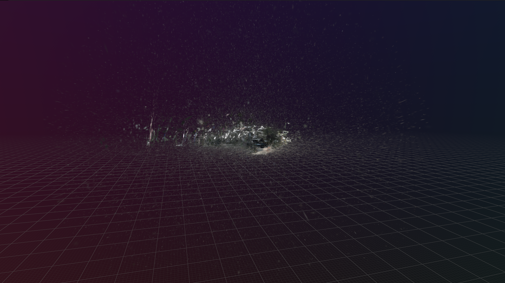
  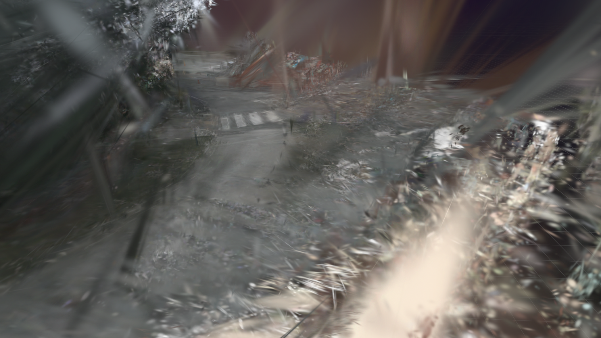
</p>
<p align="center">
  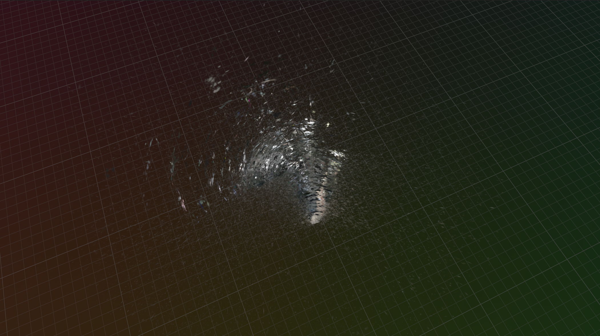
  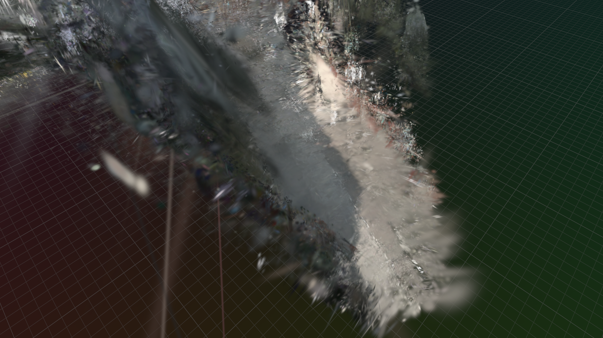
</p>
<p align="center"><sub><b>run7</b> (range mask, no prune, left) still scatters most Gaussians off-scene as a floater cloud; the mean-space prune keeps them in-scene on the road corridor (<b>run13</b>, right). Wide view (top), close view (bottom).</sub></p>

Warm-starting the bounded model and training further — even with a lower-variance batch of 5–10
views/step — did not move held-out quality (it stayed ~8.5 dB while N drifted back up): the bounded
model is already converged, and the binding constraint is the 25 m range mask, not the optimizer.
The open direction is bounding only in mean-space (looser or no pixel mask) so the mid-distance stays
supervised while the prune still removes the off-scene floaters.

<p align="center">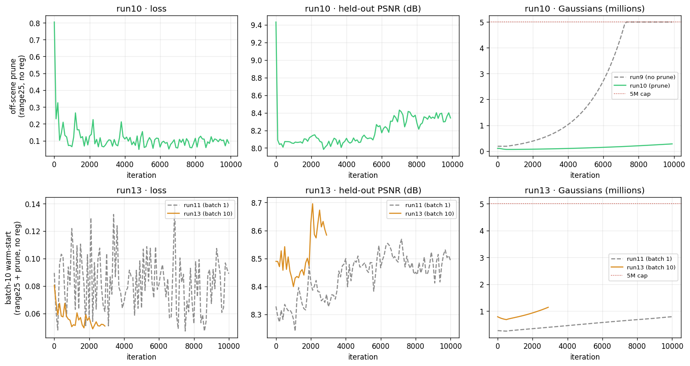</p>
<p align="center"><sub>Top — <b>run10</b> (off-scene prune): loss and held-out PSNR converge while the Gaussian count stays near 0.3M, versus <b>run9</b> (no prune) climbing to the 5M cap (right). Bottom — <b>run13</b> (batch 10) vs <b>run11</b> (batch 1): the larger batch gives a much lower-variance loss, but held-out PSNR plateaus either way (the model is already converged), and the count stays bounded.</sub></p>

Rendered views from **run9** (range mask, no regularizers, no prune, 5M Gaussians) — the
range-masked run that motivated the prune:

<p align="center">
  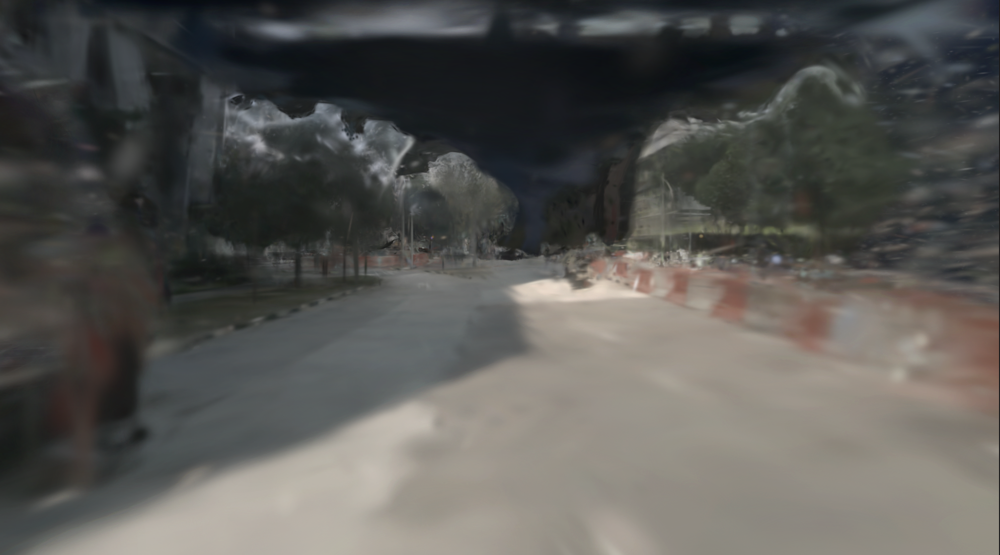
  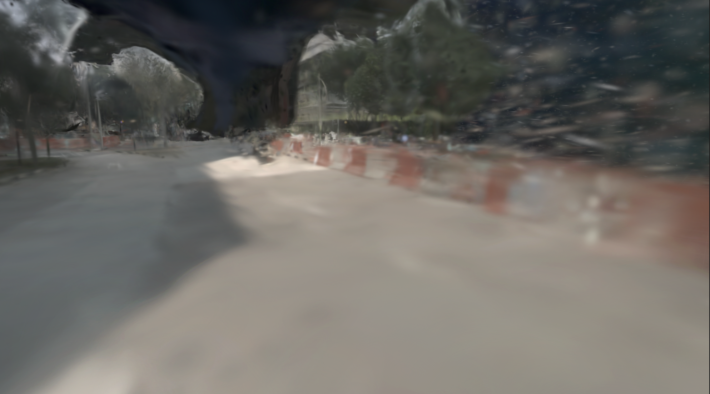
  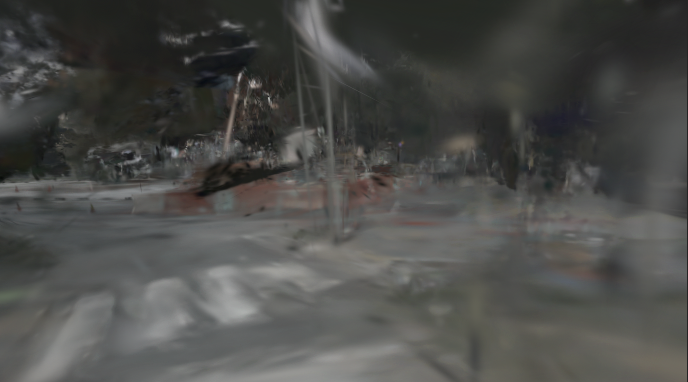
</p>
<p align="center">
  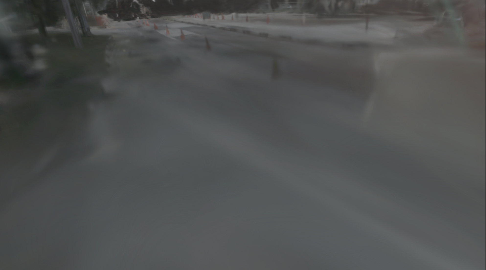
</p>
<p align="center"><sub>Rendered views from <b>run9</b> (range mask, no reg, no prune, 5M Gaussians).</sub></p>

And the bounded, warm-started model rendered along the trajectory (**run13**, batch-10 warm-start of
the prune regime):

<p align="center">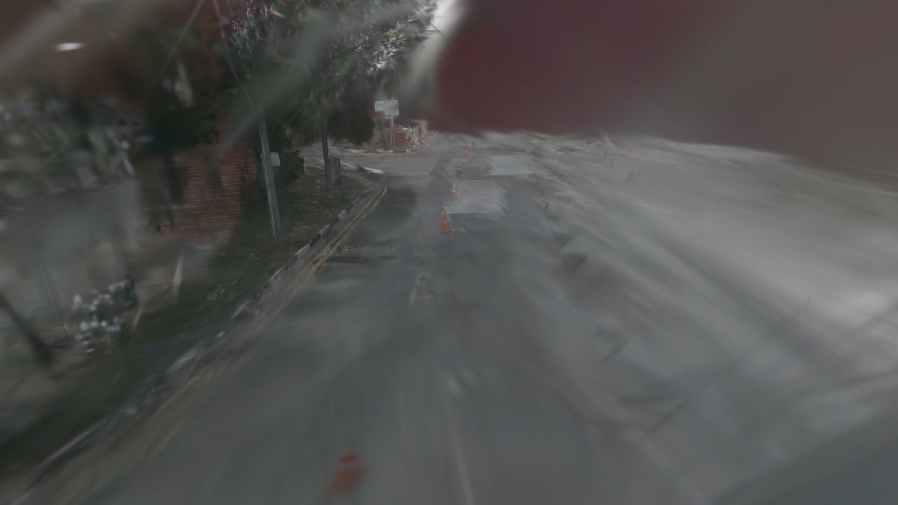</p>
<p align="center"><sub>Rendered view from <b>run13</b> (range mask + prune, batch-10 warm-start).</sub></p>

Flythroughs — the final Gaussians rendered along the camera trajectory. The source `.mp4`s live in
`docs/`; upload each via the GitHub GUI and paste its attachment link under the matching heading.

Five-frame COLMAP, with depth supervision (`docs/run5-5frame-colmap_flythrough.mp4`):

https://github.com/user-attachments/assets/77ce4b9b-1048-42a1-b21f-19c910fc7b5d

Five-frame COLMAP, no depth supervision (`docs/run5-5frame-colmap-nodepth_flythrough.mp4`):

https://github.com/user-attachments/assets/a3965007-feaf-4e47-9d17-df4808a910f2

Full 39-frame COLMAP (`docs/run6-full-colmap_flythrough.mp4`):

https://github.com/user-attachments/assets/aee273a4-ce12-43dd-ab8c-20867f21840d

Full 39-frame COLMAP, bounded by the off-scene prune (`run13`, batch-10 warm-start of the prune regime) (`docs/run13-warmstart-batch10_flythrough.mp4`):

https://github.com/user-attachments/assets/4997c045-ad1f-4506-9948-d8f3dbc0cac1

<p align="center"><sub>Regenerate any of these with <code>scripts/render_gs_video.py --scene scene-0061 --run &lt;run&gt; --mode flythrough --colmap-poses</code> (add <code>--max-frames 5 --holdout-every 2 --holdout-offset 1</code> for the five-frame runs).</sub></p>

### Pose refinement

Refining the poses through the rasterizer (run15: full scene, warm-started from run13, first view
anchored) confirms the COLMAP poses are already essentially correct here — there is little to gain.
Over the run, held-out PSNR stays flat (~8.5 dB), the train poses move only centimetres from the
COLMAP init, and the pose error against GT — measured after aligning the first (anchored) pose, so
it reflects *relative* error rather than a global gauge offset — holds at ~0.57 m (0.581 → 0.573 m),
i.e. it does not drift away from GT:

<p align="center">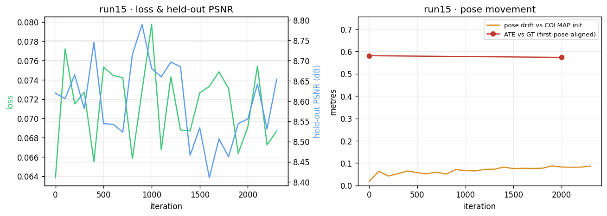</p>
<p align="center"><sub><b>run15</b> — left: loss and held-out PSNR (flat); right: pose drift from COLMAP init (cm-scale) and first-pose-aligned ATE vs GT (~0.57 m, flat). The COLMAP frontend poses are already near-GT, so joint refinement adds little on this scene.</sub></p>

This is expected: because the GPS-anchored COLMAP poses are so good, pose refinement is nearly
redundant here. It was revisited inside the **semantic ground anchor**'s joint optimization (step 5,
GPS-free) — but fixing scale and level did *not* need the poses to move: `--optimize-poses` there
drifted them 0.5°→7° and jittered positions ~2 m, hurting the metric result, so it's dropped from the
anchor route (see "Joint metric anchor + pose refinement").

### Ground-plane pre-alignment (GPS-free metric)

The semantic ground anchor recovers metric scale + level from the road plane and the known camera
height, with **no GPS** (GPS is used only for the display-time SE(2) alignment and scoring below, never
to build the reconstruction). Three stages, scored against the GPS-derived scale (20.57) and GT:

| Stage | recovered scale (÷20.57) | anchor vertical residual | camera-track RMS vs GT | horizontal RMS vs GPS |
|---|---|---|---|---|
| **(1) DA3 poses + DA3 depth** + anchor | 18.58 (~10% low) | 0.211 m | 3.91 m | 3.40 m |
| **(2–3) COLMAP→DA3 + DA3 depth**, pre-refit (DA3 anchor) | 18.58 | 0.218 m | 3.36 m | 3.01 m |
| **(4) COLMAP→DA3 + DA3 depth** + re-fit anchor | **19.96 (~3% low)** | **0.160 m** | **2.08 m** | **1.54 m** |

Stages 2–3 Umeyama-fit the COLMAP trajectory onto the DA3 poses (scale 0.047, fit RMS 0.108 in DA3
units) to borrow DA3's scale onto COLMAP's clean, dynamic-object-free trajectory, and back-project the
DA3 depth from those COLMAP-in-DA3 poses. Swapping in COLMAP's trajectory alone (keeping the DA3 anchor)
already trims the GT error 3.91→3.36 m; **re-fitting the anchor** on this combination (stage 4) is the
big win — scale 18.58→19.96 (~10%→~3%), GT error →2.08 m (roughly half of stage 1), residual →0.160 m.
`run_gs.py --colmap-to-da3 --ground-anchor --gps-align`.

The resulting **GPS-free init cloud is as metric as the GPS one** — scored against LiDAR (metric DA3
depth × the anchor scale 19.96, back-projected), matching the GPS route (run13 init, ×20.57) point for
point:

| init cloud | AbsRel | RMSE | δ<1.25 | recovered scale |
|---|---|---|---|---|
| GPS (COLMAP + metric depth ×20.57) | 0.166 | 7.01 m | 0.826 | 0.987 |
| **GPS-free** (colmap→DA3 + anchor ×19.96) | **0.159** | **6.83 m** | **0.845** | 1.017 |

So the semantic ground anchor recovers metric scale to ~2% with **no GPS**, indistinguishable from the
GPS-derived scale on the depth-vs-LiDAR metrics.

The DA3 camera poses have a bad vertical: DA3-only camera height swings 1.17→1.70 m against GT's flat
~1.5 m, while COLMAP→DA3 tracks it. The per-keyframe ground-point mean height (levelled frame) also
sits tighter around 0 for COLMAP→DA3 — the residual wave is the real road profile (a dip mid-scene, a
rise near the end), not noise.

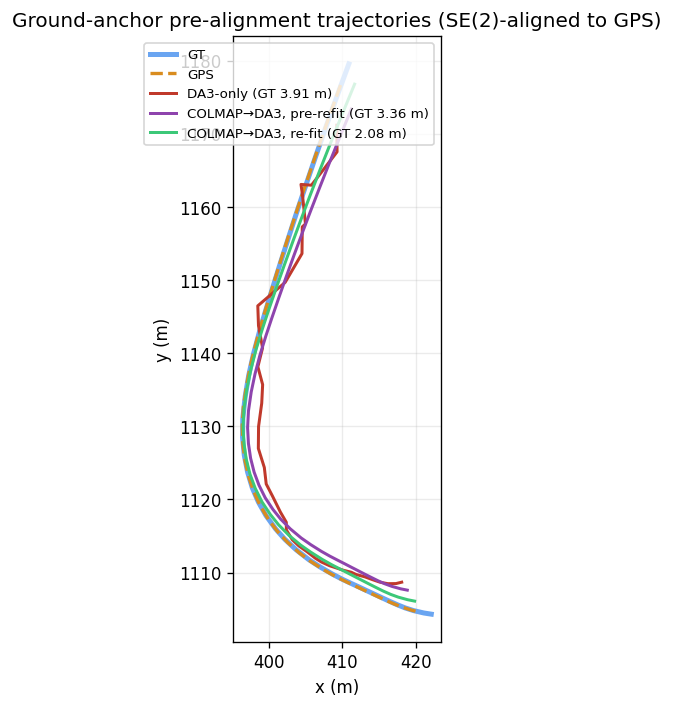
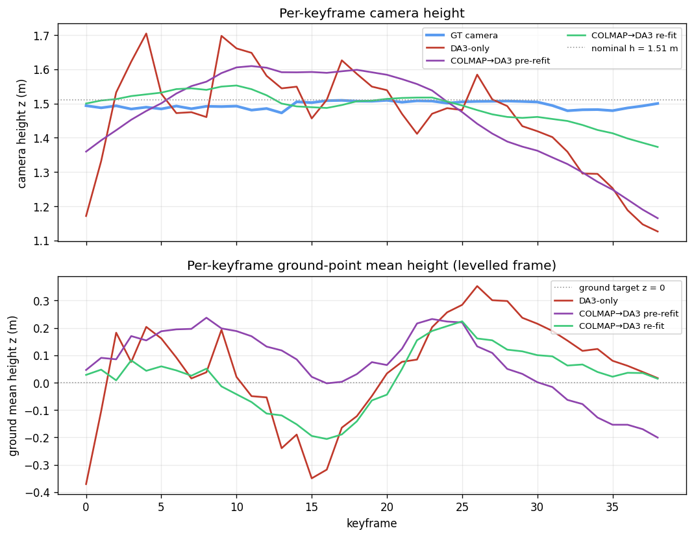

Rerun (levelled to Z-up, ground horizontal; green = ground point cloud, blue = estimated trajectory,
orange = GPS, cyan = GT, gray = camera frustums); each pair is overview + a close-up of the cameras +
ground cloud below:

**(1) DA3-only** — the ground cloud is more warped and the trajectory wanders off GPS/GT:

<p>
  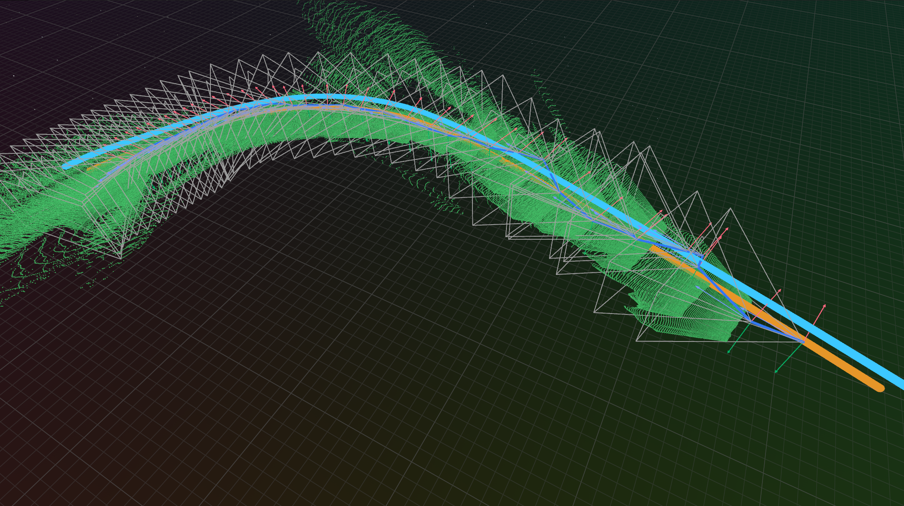
  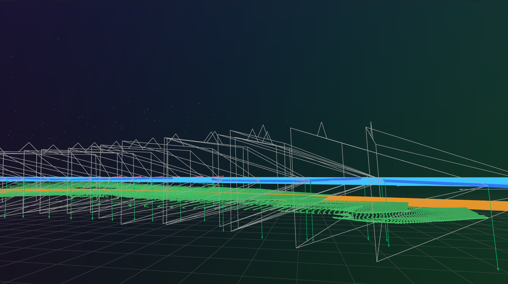
</p>

**(4) COLMAP→DA3 + DA3 depth** (re-fit anchor) — flatter ground, trajectory hugging GPS/GT:

<p>
  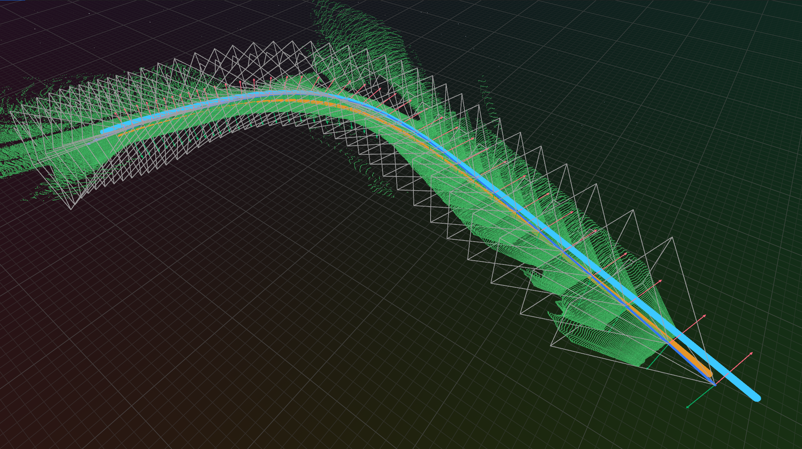
  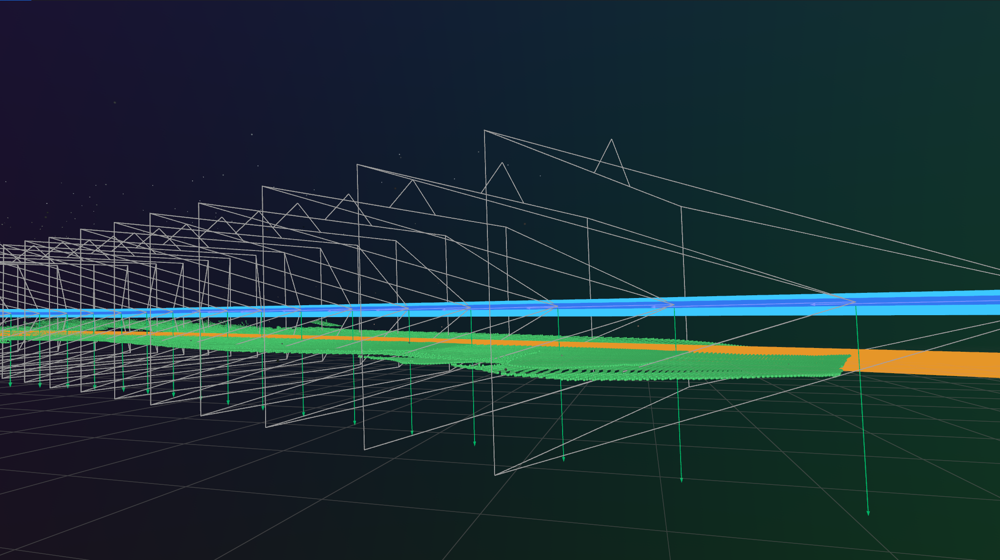
</p>

### Joint metric anchor + pose refinement (step 5, GPS-free)

Starting from that pre-aligned metric frame, the ground/ego height anchors act **directly on the
Gaussians** during a joint 3DGS optimization (10k iters), together with camera pose refinement and a
**scale-invariant (SILog) depth** term — all GPS-free (`run_gs.py --colmap-to-da3 --ground-anchor
--optimize-poses --first-pose-horizontal-only --depth-silog`). This is the Rung-2 core. The result and,
importantly, the finding that **`--optimize-poses` hurts here** are below.

**Poses vs GT** (SE(3)-rigid aligned; medians in parens — the mean is skewed by a few jagged poses):

| | position error | orientation error | yaw | tilt (roll/pitch) |
|---|---|---|---|---|
| **pre-opt** (colmap→DA3 + anchor) | 1.28 m (**1.14 m**) | 0.60° (**0.53°**) | 0.20° | 0.48° |
| **post-opt** (10k, `--optimize-poses`) | 1.97 m (**1.50 m**) | 7.05° (**6.35°**) | 4.92° | 3.34° |

The pose-opt **degraded** both: it jitters the trajectory positions (see the comparison plot) and drifts
camera orientation ~5° yaw + ~3° tilt from GT, whereas the pre-alignment poses are already near-GT
(0.5° rotation, COLMAP quality). Photometric consistency can't penalize this — the render stays fine
while the poses wander to GT-wrong-but-photometrically-equivalent configurations.

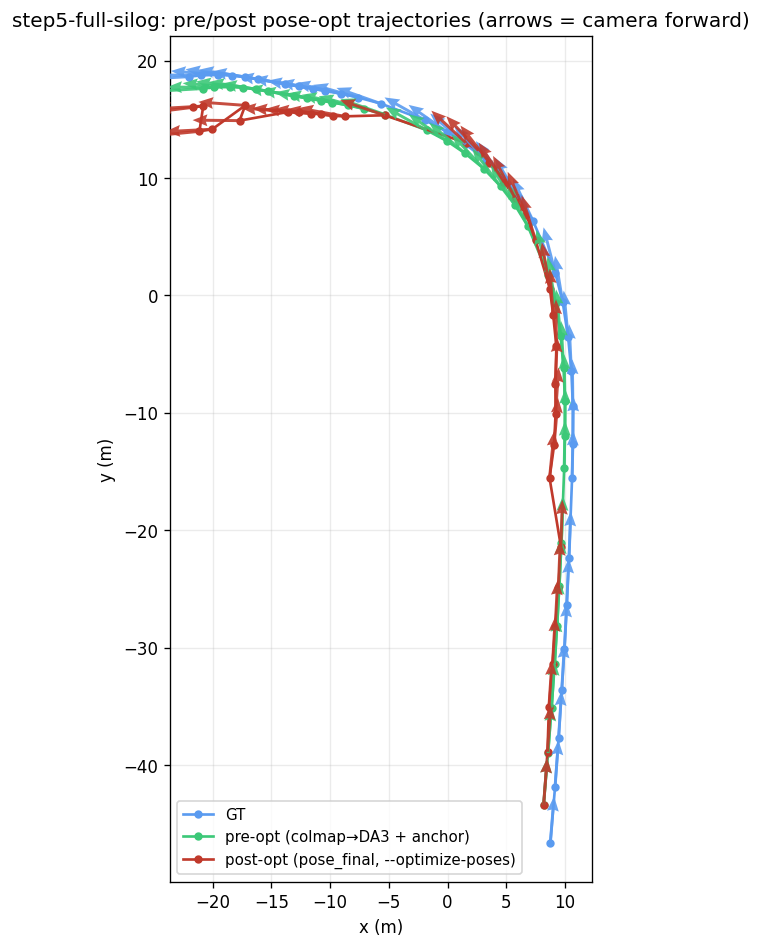
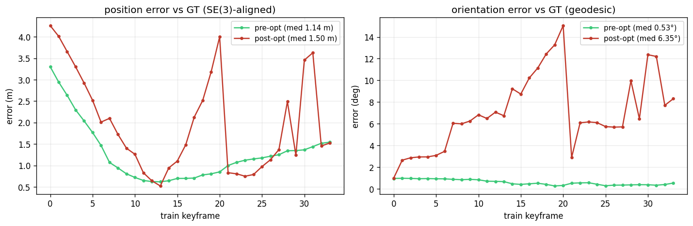

**Depth vs LiDAR** (`median(lidar/rendered)`; 1.0 = perfect metric):

| depth source | AbsRel | RMSE | δ<1.25 | recovered scale |
|---|---|---|---|---|
| init metric depth (pre-training reconstruction) | 0.159 | 6.83 m | 0.845 | 1.017 |
| 3DGS `gs_final`, rendered from its **trained poses** (as-is) | 0.352 | 12.4 m | 0.330 | **1.323** |
| 3DGS `gs_final`, rendered from **GT-aligned poses** (pose-decoupled) | 0.427 | 13.9 m | 0.557 | 1.107 |

The reconstruction's cameras *are* the trained poses, so **1.32 is the honest end-to-end number** —
rendering from GT poses (1.11) asks the model for a viewpoint it was never fit to (a diagnostic, not the
reconstruction's output). Crucially the **metric scale itself is held** by photometric consistency +
the height anchors (init 1.02; the geometry read from good poses is ~1.0) — the 1.32 is *pose error*
showing up as depth error, not a scale-holding failure. The gap between 1.32 (trained) and 1.11
(GT-aligned) is **mostly camera tilt**: the ground/ego anchors fix the vertical scale, and horizontal
position/yaw barely change depth-to-ground as long as the render is consistent, but a camera tilted
(roll/pitch) off GT reads the ground at a different distance — so the trained poses' ~3.3° tilt is what
inflates the depth scale.

**Anchors behaved** — they converged to a few cm and did **not** overpower the render:

- ground-height residual → **~0.078 m**, camera-height residual → **~0.047 m** (converged medians).
- photometric L1 fell 0.124 → **0.027** alongside the total (0.30 → 0.040) and held-out PSNR crept
  8.3 → 8.5 dB — so the anchor/depth terms coexisted with photometric improvement; no destructive
  over-weighting (the pose degradation is a pose-gauge effect, not anchor-vs-photometric tension).

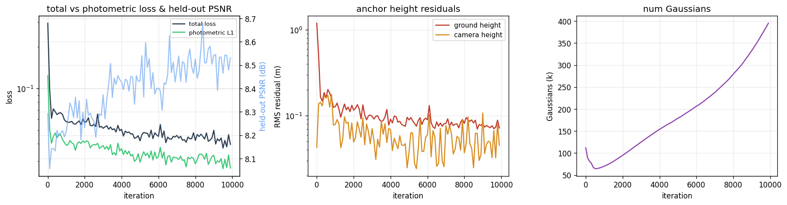

**Takeaway:** the GPS-free anchor mechanism works (metric scale ~2%, cm-level height residuals, poses
0.5° from GT *before* pose-opt), but joint `--optimize-poses` is net-harmful on this well-registered
scene — it should be dropped, leaving the near-GT pre-alignment poses. (Compare the GPS route, run13:
0.19 m / 0.71° poses, depth scale 0.974 — the GPS-free route matches on scale, and without pose-opt it
matches on poses too — confirmed next.)

_Flythrough — the final Gaussians rendered along the **training** poses, overfit to them (novel/held-out
views are noticeably softer, held-out PSNR ~8.5 dB): `docs/step5-full-silog_flythrough.mp4`._

https://github.com/user-attachments/assets/3e46d913-1f25-4f6d-84be-57d96aa75bc2

**Confirmed — dropping `--optimize-poses`** (`step5-full-silog-nopose`: same recipe — **SILog
(scale-invariant) depth + the ground/ego height anchors** — with poses fixed at the pre-alignment). It
wins on every metric, and the depth is metric **end-to-end** (rendered from its own fixed poses — no
alignment trick):

| | pose-opt | **no-pose-opt** |
|---|---|---|
| held-out PSNR / SSIM / L1 | 9.08 / 0.418 / 0.245 | **9.13 / 0.495 / 0.213** |
| photometric L1 (final) | 0.027 | **0.0155** |
| Gaussians at 10k | 395k | **979k** (no OOM) |
| ground / ego height residual | 0.078 / 0.047 m | 0.085 / 0.042 m |
| **3DGS depth vs LiDAR @ own poses** (AbsRel / δ<1.25 / scale) | 0.352 / 0.330 / 1.323 | **0.275 / 0.711 / 1.017** |

With the poses fixed at the near-GT pre-alignment (1.28 m / 0.60°), the 3DGS expected depth is **metric
to ~2%** (scale **1.017**, δ<1.25 0.711) — right on the init cloud (1.017) and the GPS route (0.974),
so the 1.32 of the pose-opt run was **entirely the pose drift**, not a scale-holding failure. And because
the depth term is SILog (scale-free), that metric scale comes from the **height anchors**, not the depth
supervision — the whole point of the semantic anchor. Photometric
also converged lower (0.0155 vs 0.027) and the model densified to ~1M Gaussians (the pose-opt run's
moving cameras had capped it near 400k / OOM'd on extension). (RMSE is outlier-inflated by floaters in
the denser model; the robust scale/AbsRel/δ are the read.) **So the GPS-free route without pose-opt
matches the GPS route on metric depth — no GPS, no GT.**

Rerun views of the no-pose-opt reconstruction (levelled Z-up frame; **green = estimated trajectory,
blue = GT** — the fixed pre-alignment poses track GT, the two lines overlap):

<p align="center">
  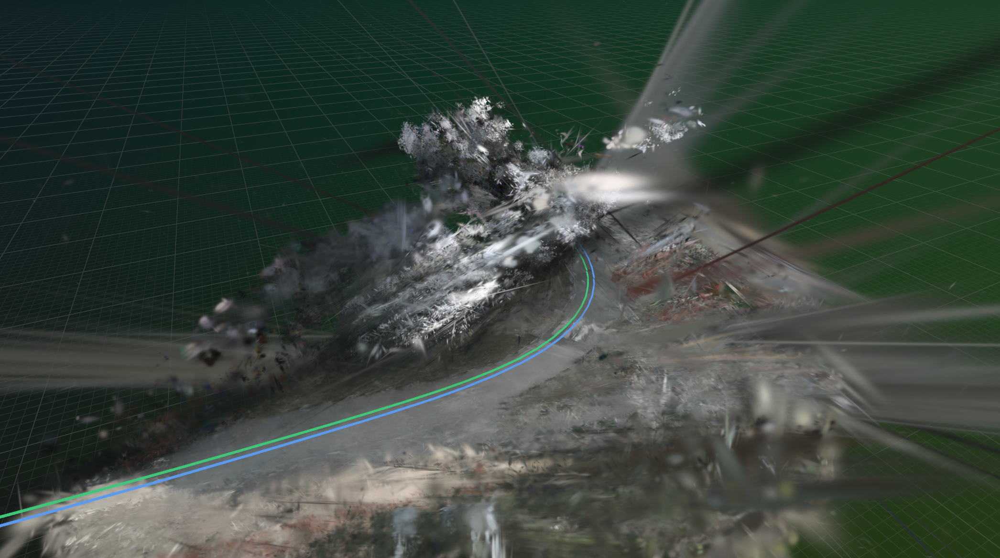
  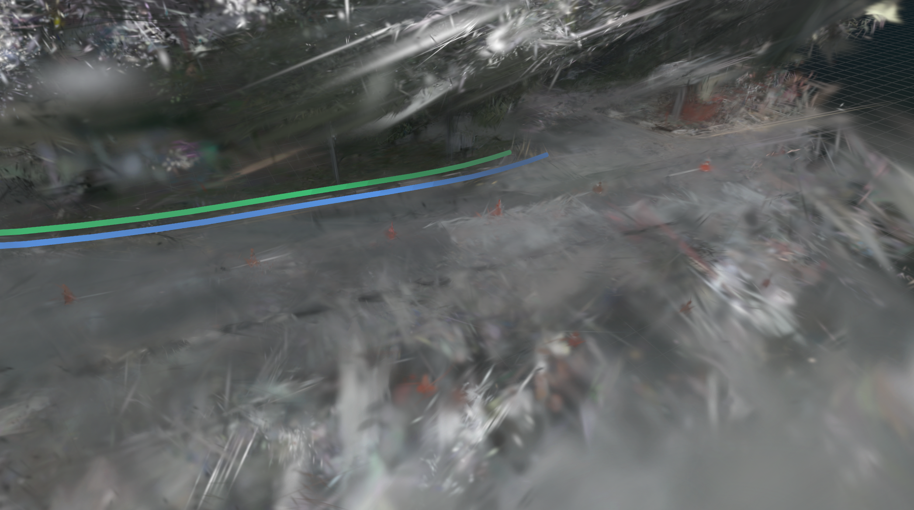
</p>
<p align="center"><sub>The Gaussian scene along the drive (overview + close-up); the estimate hugs GT. The spiky floaters in the denser ~1M-Gaussian model are what inflate the depth-vs-LiDAR RMSE while the robust scale/AbsRel/δ stay strong.</sub></p>

Flythrough — no-pose-opt run, rendered along the fixed (true) trajectory (`docs/step5-full-silog-nopose_flythrough.mp4`):

https://github.com/user-attachments/assets/954b47e7-35c5-47ad-9289-b7372ed5fecc

### Dynamic vehicles — per-instance reconstruction (GPS-free, anchor-free)

The static pipeline masks moving vehicles out; this reintroduces the tracked ones as posed per-instance
reconstructions composed back into the metric scene (the Roadmap's dynamic-objects step, as a proof of
concept). No GPS, and — unlike the static scene — **no ground anchor** for the vehicle.

**1. Per-frame instances + association.** SAM3 is an instance segmenter, but the static cache *unions*
the instances, so `Sam3Segmenter.segment_instances` keeps them separate. Instances are linked
frame-to-frame by **greedy nearest-centroid association**: globally take the closest (track, instance)
centroid pair under a pixel threshold, remove both, recompute, repeat; unmatched instances seed new
tracks. On scene-0061 (2 Hz keyframes → large inter-frame motion) this recovers a clean **39-frame
single-vehicle track** for the leading van, verified single-identity by smooth centroid + area
(frame-to-frame area ratio 0.87–1.25, centroid steps < 112 px). *Future: optical-flow-**predicted**
centroid instead of the previous frame's, Hungarian assignment, OpenCV trackers.*

**2. Per-instance geometry — two experiments.** The van is small, low-texture, reflective:

| method | registration | far→near depth (truth 5.9×) | object-centric |
|---|---|---|---|
| DA3 on crop | — | 2.3× (collapsed) | no (wrong scale) |
| DA3 on masked full frame | — | 2.0× (collapsed) | fragmented |
| **COLMAP (tuned)** | **35/35, 1.35 px** | **4.9×** | **yes** |

**DA3 fails on the isolated van.** It is intrinsic-agnostic (estimates its own `K`) and trained on
coherent-camera scenes, so a per-frame crop is out-of-distribution: with the apparent-size cue removed
and parallax already small at distance, it reads every frame as a close-up and **collapses the far→near
depth** (2.3× vs the true 5.9× the *full-scene* recon recovers). Masking the full frame is no better —
starved of context it fragments. **COLMAP works once tuned** like the static scene (known `K` held
fixed, 20 k features, SIFT peak 0.0067→0.001 for the smooth surface, relaxed mapper): 3/35 → **35/35
images**, and known-`K` triangulation recovers the correct **4.9×** far→near. COLMAP is the per-instance
workhorse; DA3-per-instance is dropped.

**3. Metric scale — a depth anchor (no ground plane).** COLMAP's reconstruction is up-to-scale, and the
vehicle has no ground anchor, so scale is transferred from the **global metric scene's depth at the
van's own mask pixels**: for every COLMAP point seen in a frame, its COLMAP depth `z_col` (point z in
that camera) is compared to the global metric depth `z_glob` at its projected pixel, and
`s = median(z_glob / z_col)` — one scalar, matching COLMAP's one-DoF ambiguity (9 452 observations,
`s = 0.0804`). *Not* a pose anchor: the van moves, so there is no single Sim(3) between COLMAP's
van-static frame and the world — only depth is frame-invariant. The scaled van comes out ≈ **2.3 m wide
× 1.5 m tall** — correct van proportions.

**4. Composition.** Bringing the van's global-depth surface into the scaled COLMAP frame via those poses,
the 35 frames' surfaces **align into one van** — the verification that scale + poses are consistent (a
wrong scale would fan the frames apart in depth). The frustums trace the ego arc approaching the
near-stationary van:

<p align="center">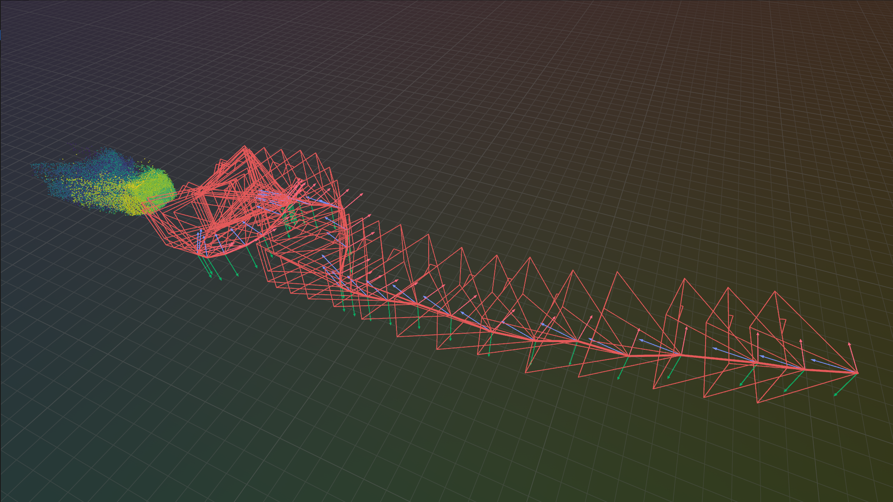</p>
<p align="center"><sub>Scaled COLMAP camera poses (red frustums, 35 frames) + the van's global-depth surface (coloured by frame). The ego arc approaches the near-stationary van.</sub></p>
<p align="center">
  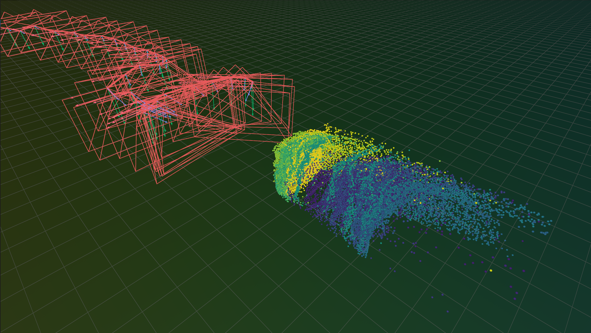
  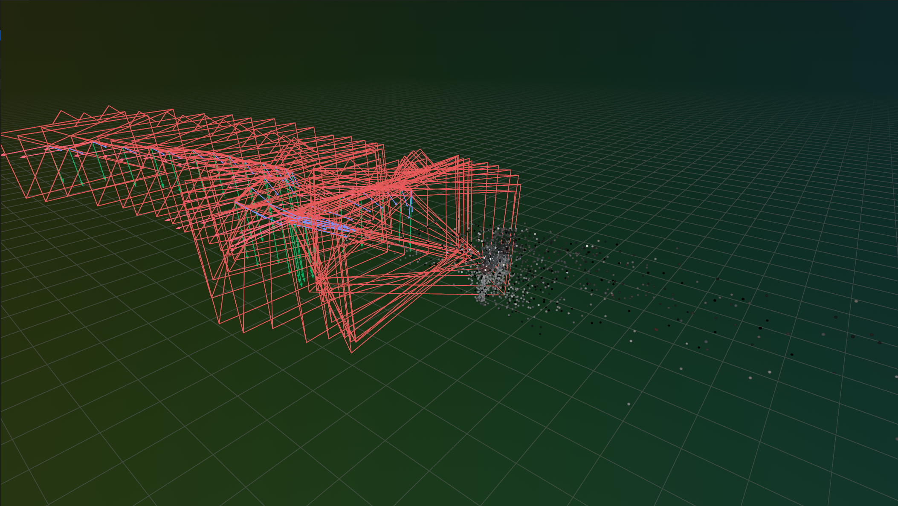
</p>
<p align="center"><sub>Left: the van's global-depth surface, coloured by frame — the per-frame surfaces align (onion-layered, ~1.4 m centroid drift). Right: the same view with COLMAP's own sparse points instead.</sub></p>

Caveats: the van depth is **onion-layered / drifts ~1.4 m** — DA3's depth on the van itself is noisy
(reflective, moving) and the COLMAP poses carry some error — and the raw cloud needs outlier trimming
(currently a blunt percentile box). The **scale is sound** — enough to seed the 3DGS below.
`out/vehicle_scaledposes.rrd`.

**5. Frozen-pose 3DGS (per-instance object).** With the scaled COLMAP poses **frozen** and the scaled
COLMAP points as the seed, a per-instance 3DGS is fit on the masked-van images (the author's
`train_gaussians`, `cap_max=100k`, batch 10): the van's global metric depth at the mask supervises the
rendered depth, the black background is supervised toward black (the sky→black term) and blank-area
pruned, and there's **no range mask** (everything off the van is blank). The result is a **metric van
that renders from held-out views**:

<p align="center">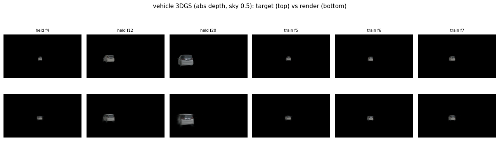</p>
<p align="center"><sub>Target (top) vs render (bottom), held-out (f4/f12/f20) + train views — novel-view generalization on the metric van.</sub></p>

Two supervision variants: **SILog** depth (scale-invariant) → 2,831 Gaussians with some floater streaks;
**absolute metric-depth L1 + 10× black weight** → 3,528 Gaussians, floaters cleared and a touch crisper.
Post-hoc rendered-depth-vs-target L1 is ~1.2 m (abs-depth) vs ~1.3 m (SILog) — the residual is dominated
by DA3's noisy van-depth *target*, not the fit. The trained van as Gaussian splats + the frozen frustums
(SILog left, abs-depth right):

<p align="center">
  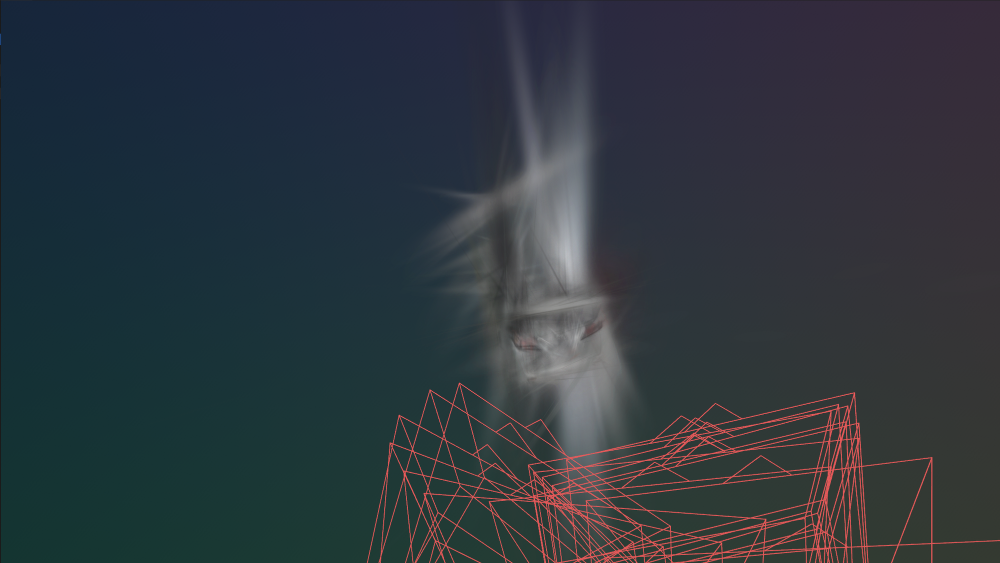
  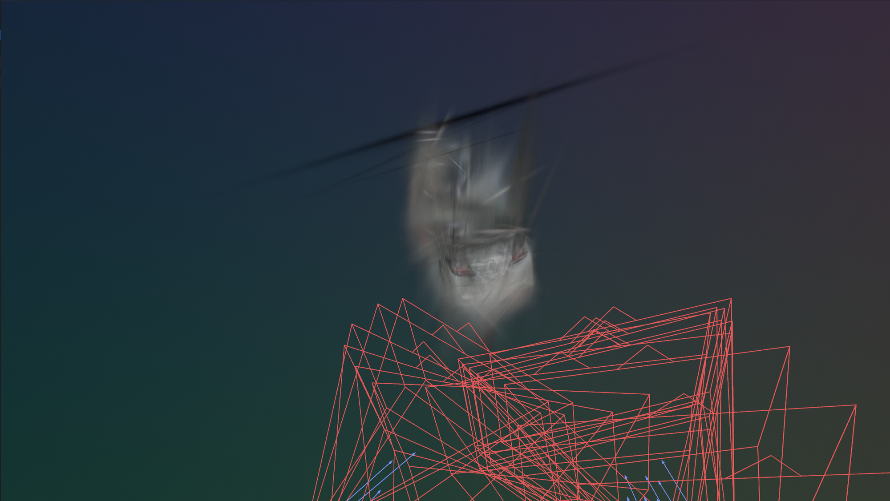
</p>

`out/vehicle_gs.{npz,rrd}` + `vehicle_gs_flythrough.mp4` (SILog), and `out/vehicle_gs_depth.{npz,rrd}` +
`vehicle_gs_depth_flythrough.mp4` (abs-depth).

**6. Composed into the static scene.** The trained van 3DGS is composited into the static-scene 3DGS
(the no-pose run's `gs_final`, 979k Gaussians) by bridging their two coordinate frames **through the
shared ego cameras**: `T_i = pose_scene[i] · diag(anchor_scale) · pose_van[i]⁻¹` maps the van (its own
scaled-COLMAP frame) into the anchored scene frame, per frame. Both are then rasterized together along
the ego trajectory, with the camera **and** the van's local trajectory interpolated so the van moves
smoothly and stays composited every frame:

<p align="center">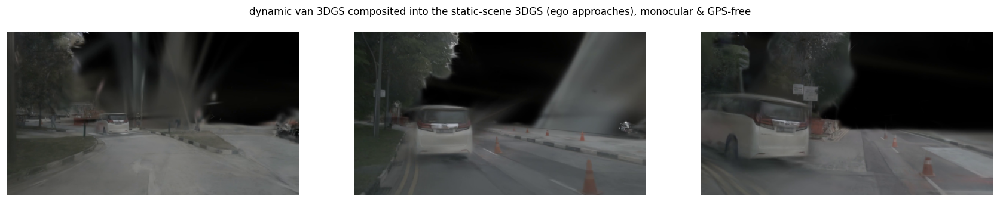</p>

https://github.com/user-attachments/assets/b8e293aa-30f3-49c8-8066-9cbd32bb1fac

This closes the dynamic-vehicle loop end to end — association → tuned COLMAP poses → depth-anchor scale
(no ground anchor) → frozen-pose 3DGS → a metric vehicle **composited back into the metric static scene
and moving through it**, all monocular and GPS-free. (`out/vehicle_in_scene.mp4`. Residual artifacts —
the dark sky→black blob and some van softness — are inherited from the underlying reconstructions.)

*Planned refinement:* **point-cloud registration (ICP)** on the per-frame globally-scaled van-depth
surfaces to refine the COLMAP poses — collapsing the onion layers onto one surface — so that when the
vehicle is placed back into the global scene through those poses it lands exactly where it should.

### Qualitative outputs

Produced by the viz scripts (into the gitignored `out/`), each pose-source aware:

- `scripts/render_gs_video.py --mode flythrough` — the final Gaussians rendered along the camera
  trajectory (`--colmap-poses` / `--gt-poses` to fly the run's own poses).
- `scripts/render_progress_video.py` — the run's saved train + held-out renders, GT over estimate,
  stitched across iterations (correct for any pose source, no re-render).
- `scripts/replay_gs_rrd.py` — the full-density Gaussian evolution (all snapshots + the final) +
  curves + GT/render images as a Rerun `.rrd`, scrubbable on the `iter` timeline.

## Metric factor-graph SLAM (submap Sim(3) graph)

The stages above resolve metric scale inside a single batch reconstruction. This section lifts that
into a **factor graph** over a chain of overlapping submaps — the structure a real incremental SLAM
system needs — while keeping the same principle: metric geometry from calibration plus a semantic
ground anchor, never from ground truth. It is built and evaluated end-to-end on `scene-0061`
(`nuslam.backend`); the render-as-a-factor / IMU / GPS fusion is the remaining parked extension.

### Why a factor graph, and the relation to VGGT-SLAM

A batch solve over one window does not scale: drift accumulates, the linear system grows, and there
is no incremental relinearization. The standard answer is a **factor graph** — variables (camera
poses, scales) tied by **factors** (measurements, each a residual with a noise model), solved by
sparse nonlinear least squares (GTSAM / Levenberg–Marquardt here, iSAM2 later).

The submap structure follows **VGGT-SLAM**. VGGT-SLAM 1.0 ([Maggio et al., *Dense RGB SLAM Optimized on
the SL(4) Manifold*](https://arxiv.org/abs/2505.12549)) does dense SLAM over feed-forward VGGT
reconstructions by splitting the stream into overlapping submaps and aligning them — but, being
uncalibrated, it optimizes **15-DoF SL(4)** homographies between submaps and inherits the full projective
ambiguity (no metric, no gravity). VGGT-SLAM 2.0 ([*Real-Time Dense Scene
Reconstruction*, arXiv:2601.19887](https://arxiv.org/abs/2601.19887)) **keeps the SL(4) factor graph** but
removes the 15-DoF drift *by construction*: consecutive submaps share a single **common keyframe** (the
last of one is the first of the next), which by construction has the **same pose and camera
calibration**, so the alignment is constrained to a subset of SL(4) rather than a free 15-DoF fit. It
stays on SL(4) — it does **not** switch to Sim(3).

This work adopts 2.0's **single-shared-keyframe (one-frame) overlap** structure, but because we have
**known intrinsics** and the DAQ metric upgrade, the projective mismatch is already gone — so *our*
submap-alignment variables collapse from SL(4) to **Sim(3)** (7-DoF), the reduction VGGT-SLAM cannot make
while uncalibrated. On top of that, the global scale gauge is broken **from semantics** — a road-plane
ground anchor plus the known camera-mounting height — inside the graph, and each submap is reconstructed
independently (per-window COLMAP + DA3-Base + DAQ) so the shared boundary frame is reconstructed twice
and carried as **two** Sim(3) variables tied by the alignment factor. The Sim(3) reduction and the
semantic-metric anchor are the contribution; the submap-and-shared-keyframe skeleton is adapted from
VGGT-SLAM 2.0.

### Submap architecture

`scene-0061` (39 CAM_FRONT keyframes) is split into 5 submaps, each an **independent** reconstruction in
its own up-to-scale COLMAP frame (COLMAP + DA3 + DAQ per window). Adjacent submaps overlap by **exactly
one frame** — the boundary frame (here frames 9, 16, 23, 30) — which is reconstructed **twice**, once in
each submap, and so becomes two variables tied by a submap-alignment factor. That single shared camera is
the only thing coupling two submaps, which is the minimal, honest test of the alignment. Submaps are
chain-placed into a common world for initialization only, by **one** $\mathrm{SE}(3)$ composition per
overlap: the full 6-DoF pose that carries that one boundary camera's local pose onto its already-placed
world pose, applied rigidly to the whole submap (no scale fit, no Umeyama over multiple centres — scale
is left entirely to the anchors).

### Variables

| Variable | Type | Meaning |
|---|---|---|
| $H^m_j$ | `gtsam.Similarity3` | submap $m$'s camera $j$: local COLMAP frame → world. Its scale $s$ is COLMAP-units → metres. Overlap frame ⇒ one $H$ per submap. |
| $\rho_m$ | `double` | $\log\big(\mathrm{median}(z^{\text{colmap}}/z^{\text{da3}})\big)$, the DA3-depth → COLMAP-units log-ratio, one per submap. |

Two scales, deliberately (this is the crux of a monocular metric submap graph): $\rho_m$ converts DA3
depth into that window's arbitrary COLMAP units; $s_i$ (inside $H_i$) converts COLMAP units into
metres. The world point of a pixel $\tilde u$ at DA3 depth $d$ is

$$X \;=\; s_i R_i\,\big(e^{\rho_m}\, d\, K^{-1}\tilde u\big) \;+\; s_i t_i \;=\; H_i \cdot \big(e^{\rho_m} d\,K^{-1}\tilde u\big).$$

Log-scale, not scale: positivity is free and the ratio factor becomes linear. GTSAM's `Similarity3`
stores $H=\left[\begin{smallmatrix}R&t\\0&1/s\end{smallmatrix}\right]$ and acts as
$\mathrm{transformFrom}(p)=s(Rp+t)$, so the **camera centre is $s\,t=\mathrm{transformFrom}(0)$, not
$t$** — a convention that has to be respected everywhere a centre is read or a factor Jacobian written.

### Factors

The generic backbone is stock GTSAM; the semantic-metric couplings are custom factors in
`nuslam.backend.factors` (residual + analytic Jacobians written by hand — the Python wrapper of this
build exposes no `OptionalJacobian`/`numericalDerivative` for `Similarity3`, so the Jacobians are
derived in closed form; see the GTSAM handbook for the full derivations, verified against numerical
differentiation to $\sim\!10^{-10}$).

**COLMAP relative (within-submap)** — stock `BetweenFactorSimilarity3`. Consecutive poses are tied by
the window's COLMAP relative pose with scale ratio $1$: $\ \mathrm{meas}=H^m_{j-1}{}^{-1}H^m_j=(R_{\text{rel}},t_{\text{rel}},1)$.
This pins the trajectory **shape** in COLMAP units; it says nothing about absolute scale (all $s$ within
a submap share one value).

**Depth-ratio prior** — stock `PriorFactorDouble`: $\rho_m \sim \log\hat r_m$, $\sigma = 1.4826\cdot\mathrm{MAD}(\log r)$
(the outlier-robust spread of the per-point COLMAP/DA3 depth ratios in the window).

**Submap-alignment** — custom, on the two $H$ variables of a shared camera **and both** $\rho$'s. A
shared camera coincides, so the two submaps' poses must be equal up to the pure scale ratio $s_n/s_m$.
The subtlety is that this ratio is **not** the raw DA3 depth ratio: a shared 3-D point has one metric
depth computed either way, $s_m e^{\rho_m} z^{\text{da3}}_m = s_n e^{\rho_n} z^{\text{da3}}_n$, so

$$\hat s = \frac{s_n}{s_m} = \exp\!\big((\rho_m-\rho_n) - \log\hat r\big),\qquad \log\hat r=\log\mathrm{median}\,\tfrac{z^{\text{da3}}_n}{z^{\text{da3}}_m},$$

which depends on the **variables** $\rho_m,\rho_n$ — hence a custom factor, not a fixed-measurement
between-factor. Residual $r=\mathrm{Log}\big(\mathrm{meas}^{-1}(H^m{}^{-1}H^n)\big)$ with
$\mathrm{meas}=(I,0,\hat s)$; the two $H$ columns are the ordinary between-factor Jacobians
($J_r^{-1}(r)$ side), and the two $\rho$ columns enter through the measurement on the left, giving
$\partial r/\partial\rho_m=-J_l^{-1}(r)\,e_\lambda$, $\partial r/\partial\rho_n=+J_l^{-1}(r)\,e_\lambda$
(left Jacobian inverse — not right; they agree only at $r=0$). Empirically the $\rho_m$ span 2.1–2.7
across the five windows, so dropping the $e^{\rho_m-\rho_n}$ correction puts $\hat s$ off by up to
$2\times$ and the solve diverges.

**Gauge (first pose)** — the reconstruction has a free 7-DoF $\mathrm{Sim}(3)$ gauge that must be
pinned, but **only where the anchors cannot**. A horizontal ground plane is invariant to horizontal
translation and yaw, so those 3 DoF are pure gauge; $z$, roll, pitch are what the plane *measures* and
scale is what ego measures — pinning them would fight the anchors. So the first-pose gauge is a custom
**horizontal-translation + heading** factor, built with a rotated-axis-normalization construction:

$$r_{\text{pos}} = (H_0\,e_0)_{xy}-(0,0),\qquad r_{\text{head}} = \frac{(H_0 e_z - H_0 e_0)_{xy}}{\lVert\cdot\rVert}-(1,0),$$

i.e. the camera centre's horizontal position, and the forward axis projected to the ground and
normalized to a unit heading. Both are scale-free by construction (the position's zero-set $t_{xy}=0$ is
independent of $s$; the heading is a unit direction, so normalization divides $s$ out and its $\lambda$
column is exactly $0$). It fixes $(x,y,\text{yaw})$ and nothing else. A twin **upright** factor (down
axis normalized, targets zero horizontal component → roll/pitch) exists for robustness but is **off by
default** — see the collapse discussion below.

**Ground anchor** — custom, binary on $(H_i,\rho_m)$: a road pixel back-projected to its DA3 depth must
lie on the ground plane $z=0$,

$$r = e_z^\top\big(H_i\cdot e^{\rho_m} d\,K^{-1}\tilde u\big)\ \to\ 0.$$

Road pixels come from the segmentation frontend (road minus sky/vehicle); per frame they are
RANSAC-plane-gated in the camera frame (rejecting curb/low-object mask bleed — RANSAC, not
least-squares), Huber-robustified, and the noise is **normalized by the surviving point count**
($\sigma\propto\sqrt{N}$) so a frame's ground evidence carries a fixed weight regardless of how many
pixels survive. This factor fixes the plane ($z$, roll, pitch) but is **scale-free**: a plane at $z=0$
is unchanged by a global rescale, so it cannot pin $s$ alone.

**Ego-on-ground anchor** — custom, unary on $H_i$: the ego origin sits on the road plane,

$$r = e_z^\top\big(\underbrace{s_i t_i}_{\text{metric centre}} + \underbrace{R_i\,p_{\text{local}}}_{\text{metric lever, unscaled}}\big)\ \to\ 0,\qquad p_{\text{local}}=(\text{sensor}\to\text{ego})^{-1}_{:3,3},$$

where $p_{\text{local}}$ is the camera→ego-origin offset from the extrinsics, **in metres and rotated but
not scaled** (feeding it through `transformFrom` would double-scale a metric quantity). This is the one
metric length in the graph: the camera floats a known height above the road, so it is what breaks the
scale gauge. Its Jacobian is $\big[-R_i[p_{\text{local}}]_\times \mid s_iR_i \mid 0\big]_{z,:}$ — the
$\lambda$ column is $0$ (the centre is scale-invariant in the right tangent), so scale is observed
*through the ground+ego pair jointly*, not through this factor's scale column. The ground fixes the
plane; ego supplies the metre; neither alone observes scale.

### Resolving the scale-collapse: a GT-free metric init

Turning the anchors on exposes a spurious minimum at $s\to0$: as scale vanishes every world point
$s(Rp+t)\to0$, so **all** ground residuals are satisfied by collapse (and, satisfied, stop constraining
roll/pitch, freeing the rotation to null the ego lever too). It is a competing basin, not a missing
constraint — initialized at metric scale the solve stays there (ATE ~5 m); initialized at $s=1$ it
slides into collapse. The fix is a **one-time, GT-free metric init**: (1) rotate the world so the first
camera's down axis maps to world $-z$ (upright, making $z$ up), then (2) set the global scale from the
ego constraint itself, $\alpha = \text{cam\_height} / \mathrm{median}_i\big(C_{i,z}-z^{\text{ground}}_i\big)$
— the up-to-scale camera-height-above-road driven to metres. No RANSAC, no GT: just the median
camera-vs-ground height. With this init the upright factor is redundant (identical ATE on or off), so
it is off by default; the anchor covariances are then tuned once, offline, by starting everything soft
except the gauge and tightening the ground/ego balance until scale locks without collapsing.

### Results

`scene-0061`, 5 submaps, anchors on, GT-free metric init, evaluated against nuScenes GT ego poses.
Because the reconstruction is **metric and gravity-aligned**, it is scored under an **SO(2) ("se2")**
alignment — yaw + translation, **scale fixed to 1** — which removes only the horizontal gauge the graph
leaves free and lets any scale or tilt error survive into the error. A Sim(3) alignment is reported too,
purely as a diagnostic: it absorbs scale, and its fitted scale is the residual scale error.

| Alignment | ATE rmse | ATE median | RPE trans | RPE rot | fitted scale |
|---|---|---|---|---|---|
| **se2** (SO(2)+t, scale = 1) — the metric score | **2.38 m** | 1.52 m | 0.52 m | 0.69° | 1.000 |
| se3 (SE(3), scale = 1) | 2.38 m | 1.52 m | — | — | 1.000 |
| sim3 (7-DoF, absorbs scale) — diagnostic | 1.43 m | 0.96 m | — | — | 1.086 |

That `se2 ≈ se3` confirms the frame is genuinely gravity-aligned (nothing tilts to reduce the error),
and that `sim3` only improves to 1.43 m by fitting `scale = 1.086` shows the metric scale is correct to
**~9%** — the gap between the rows *is* that scale error. Recovered camera heights are 1.14–1.60 m
against a true mounting height of 1.51 m.

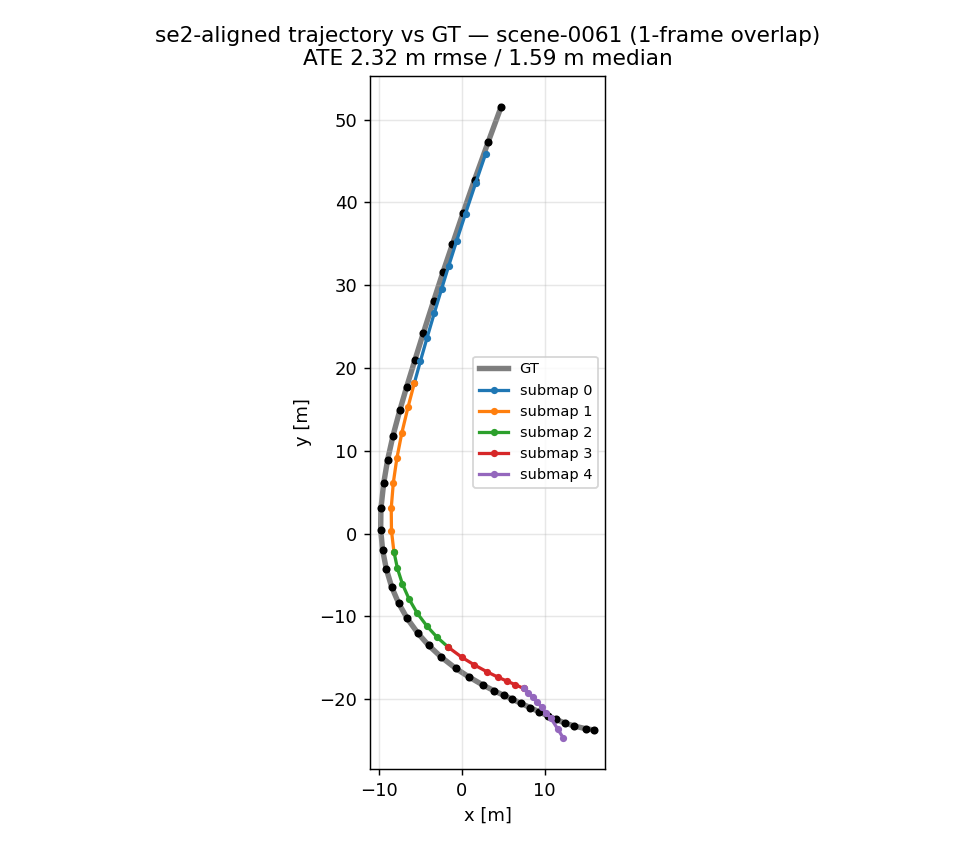

Top-down, se2-aligned: the five submaps (coloured) track the GT ego track (grey); the tail drift is
submap 4 (purple), consistent with the height plot below.

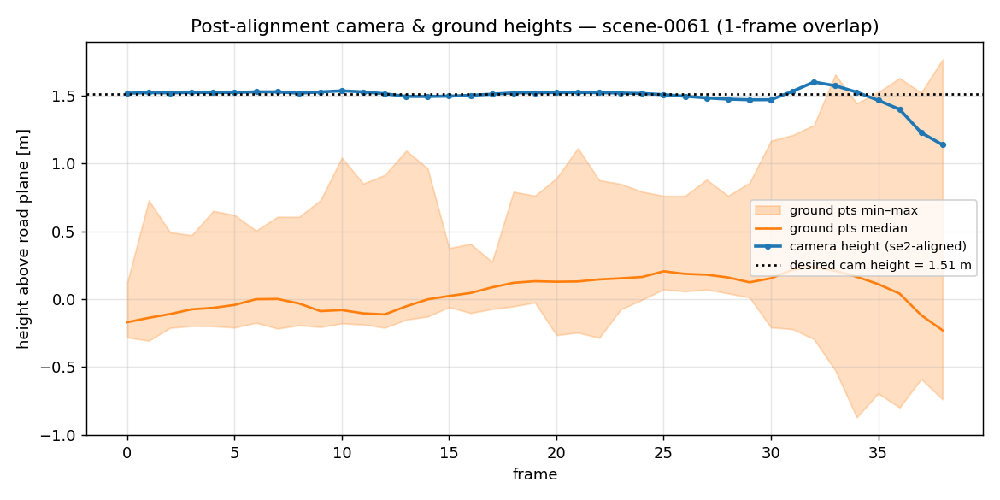

Per-frame, se2-aligned: the camera height (blue) tracks the desired 1.51 m (dotted) across the run,
drifting only in the final submap; the road points (orange median, min–max band) sit at the $z=0$ plane
the ground anchor enforces. The tail drift and the band spread are the visible form of the residual 9%
scale error.

The full SO(2)-aligned reconstruction — per-submap point clouds and camera trajectories (one colour per
submap) overlaid on the GT track (white) — is in `docs/factorgraph_se2.rrd`
(`rerun docs/factorgraph_se2.rrd`):

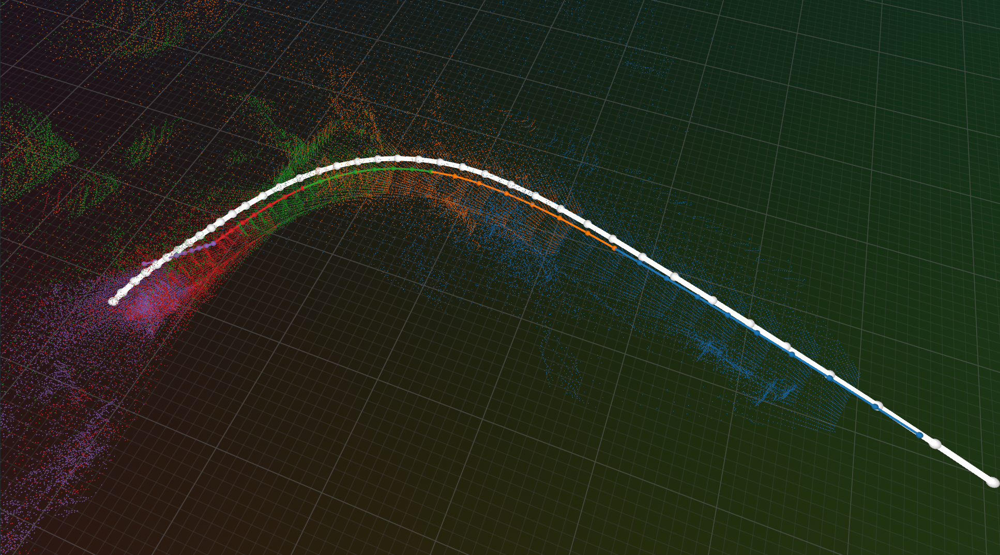
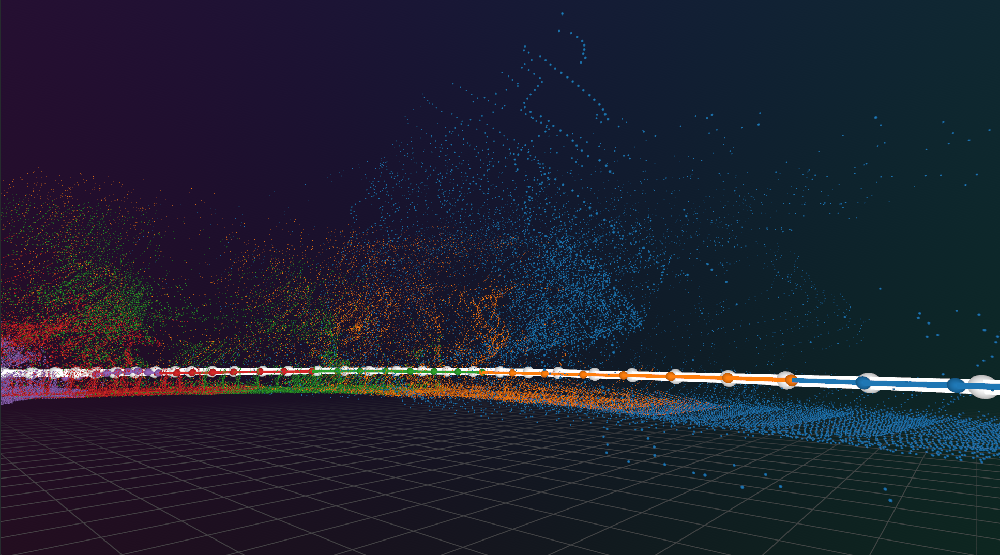

Top: the coloured per-submap point clouds and camera trajectories overlaid on GT (white) — the tracks
coincide and the submaps tile the scene. Bottom: the side view shows the reconstruction is flat on the
ground plane with the cameras floating at the metric mounting height.

**Ground-mask quality (a limitation).** The ground anchor consumes **SAM3** road masks
(`sam3-road-0.35`, minus sky and vehicle). They are imperfect — `docs/ground_masks.mp4` overlays the
anchor's ground mask on every frame — and worst in the last submap, where the road label bleeds across
the curb onto the raised sidewalk/median (with traffic cones) that is **not coplanar** with the
drivable road. Those off-plane points noise up the ground-plane fit there, which is part of why the
residual scale/tilt error concentrates in submap 4. The RANSAC per-frame plane gate rejects the worst
of it, but a tighter road label (or an explicit curb/kerb exclusion) is the clean fix.

## Roadmap

- Bound only in mean-space — the pixel range mask and the off-scene prune are built (see Results);
  the range mask darkens the well-observed mid-distance, so the next step is to keep the mean-space
  prune (which holds the model to ~278k in-scene Gaussians at no quality cost) while loosening or
  dropping the pixel mask, so the mid-distance stays supervised. Consider a low-opacity prune too.
- Dynamic objects — reconstructing the masked-out vehicles as posed per-instance objects composed back
  onto the static scene. **Built so far** (see "Dynamic vehicles"): SAM3 per-instance masks + greedy
  nearest-centroid association → single-vehicle track; tuned COLMAP for the per-instance poses (DA3 fails
  on the isolated van); depth-anchor scale from the global metric depth at the van mask (no ground
  anchor); **frozen-pose 3DGS** on the masked van (SILog + absolute-depth variants) → a metric van that
  renders from held-out views; and the van **composited into the static-scene 3DGS**, both rendered
  together along the ego trajectory with the vehicle transformed per frame (`vehicle_in_scene.mp4`) —
  the loop closed — the van moving along the road is placed per frame, so the composition shows its real
  motion through the static scene. **Next:** ICP / point-cloud registration on the per-frame
  globally-scaled van depth to refine the poses (collapse the onion layers) so the van lands even
  tighter; a denser/cleaner van reconstruction and taming the sky→black artifact; then multiple
  simultaneous vehicles, and the tracking upgrades (flow-predicted centroid, Hungarian, OpenCV trackers).
- Pose refinement — built (`--optimize-poses`, recentered frame, first-pose anchor, pose logging +
  `pose_snapshots/`; see Results). On this scene it adds little because the GPS-anchored COLMAP poses
  are already near-GT, and — now tested inside the joint ground-anchor optimization (step 5) — it is
  actively **net-harmful** (drifts poses 0.5°→7°, jitters positions ~2 m); dropped from the anchor route.
- Ground/wheel scale anchor — the semantic metric anchor, a **GPS-free** scale source (cameras +
  calibration + ground segmentation, no GPS; GPS itself is onboard proprioception, also never GT). The GPS-free
  pre-alignment is built (`--ground-anchor`, `--colmap-to-da3`; `nuslam.recon.ground_anchor`, method in
  "Ground-plane pre-alignment"), and **steps (1)–(4) below are validated** (numbers vs the GPS-derived
  scale 20.6 / vs GT, GPS used only for the display-time eval alignment, not to build the scene):
  - **(1) ground-align the DA3 reconstruction** to recover metric scale from the ground plane, no GPS
    (`--no-colmap-poses --no-scale --ground-anchor`) — recovers $s \approx 18.6$ (~10%), trajectory
    RMS vs GT 3.9 m (DA3's own poses are corrupted by dynamic objects). **Done.**
  - **(2) Umeyama-fit COLMAP → DA3** to borrow DA3's scale onto COLMAP's clean, dynamic-object-free
    trajectory (scale comes from the ground, trajectory shape from COLMAP). **Done** (`--colmap-to-da3`).
  - **(3) back-project the DA3 depth from those COLMAP-in-DA3 poses** — depth and poses now share a
    scale, so the seed cloud has an approximately-correct scale and trajectory. **Done.**
  - **(4) re-fit the ground anchor on the COLMAP-in-DA3 + DA3-depth combination** to refine scale +
    orientation (`--colmap-to-da3 --ground-anchor`) — recovers $s \approx 20.0$ (**~3%**), trajectory
    RMS vs GT **2.1 m** and horizontal RMS vs GPS **1.5 m** (roughly half the DA3-only error). **Done.**
  - **(5) joint 3DGS + pose optimization with the ground/ego-height anchor acting directly on the
    Gaussians** (the Rung-2 core) — **built and validated** (`--ground-anchor --depth-silog`, plus the
    per-batch ground-point + camera-height residuals acting on the Gaussians; run `step5-full-silog`, see
    "Joint metric anchor + pose refinement"). The anchors act directly on the Gaussians and hold metric
    scale **natively**: geometry scale ~1.0–1.02 vs LiDAR (matching the GPS route), converged height
    residuals ~8 cm (ground) / ~5 cm (ego), and photometric kept improving alongside (no anchor-vs-render
    tension). The pose/depth-vs-LiDAR evals were re-run — the GPS-free route matches the GPS route on
    metric scale. **Done.** Key finding: joint `--optimize-poses` is **net-harmful** on this
    well-registered scene (drifts poses 0.5°→7°, jitters positions ~2 m), so the trained-pose
    depth-vs-LiDAR is dominated by that drift; the next full run should **drop `--optimize-poses`** and
    keep the near-GT pre-alignment poses. Still open: a clean depth-only vs anchor-only vs neither
    ablation, and the wheel-contact (vs ground-region-only) anchor.

  Also: replace the anchor's $1/\sqrt{N}$ family balancing with inverse-covariance weighting (per-point
  depth variance + camera-height variance; see "Ground-plane pre-alignment"), which also returns a
  covariance on $(g,s)$. De-risked with the explicit pre-alignment above; **not yet** folded into the
  joint optimization.
- Factor-graph SLAM — the **submap Sim(3) metric factor graph is built and evaluated** (GTSAM; see
  "Metric factor-graph SLAM"): 5 submaps, 1-frame overlap, semantic-ground + ego-height anchors, GT-free
  metric init, **se2 ATE 2.38 m** on `scene-0061` with scale locked to ~9%. Near-term on it: tighter road
  masks / kerb exclusion (the SAM3 bleed that concentrates the residual scale error in the last submap),
  a wheel-contact anchor beside the camera height, and inverse-covariance ground weighting. Still the
  parked extension — each a standard factor on the same Sim(3) variables at no structural cost: the
  **3DGS render as a factor** (one term among several, never the sole pose authority — §"Pose
  refinement" shows it fails alone), **IMU** (gravity→roll/pitch, gyro→yaw — the DoF that drift under
  photometric pose-opt), **wheel odometry**, robustified **GPS** as a drift correction (not a scale
  source — the GPS-free claim survives), **loop closure**, and the lift from batch LM to **iSAM2**.

## How to run

Setup:

```bash
./scripts/setup_env.sh      # venv (reuses system torch 2.9.1+cu129) + pip deps
./scripts/setup_gsplat.sh   # matched CUDA 12.9 toolchain + gsplat kernels built
```

`setup_gsplat.sh` exists because gsplat JIT-compiles its CUDA kernels against the torch build,
which needs a 12.x nvcc while the system nvcc is 13.1; it installs a CUDA 12.9 conda toolchain and
a `.pth` hook so every `.venv/bin/python` builds/loads gsplat transparently. Verify:

```bash
.venv/bin/python -c "import gsplat; from gsplat.cuda._backend import _C; print('gsplat', gsplat.__version__, _C is not None)"
```

Data — nuScenes v1.0-mini (~4.2 GB, no login). Symlink an existing copy or fetch:

```bash
ln -s /path/to/nuscenes data/nuscenes      # or: ./scripts/download_data.sh data/nuscenes
```

Verify the infrastructure before trusting anything downstream — clean masks and correct geometry
first:

```bash
.venv/bin/python scripts/inspect_sample.py --scene scene-0061 --index 10 --lidar --out out/calib_lidar.png
.venv/bin/python scripts/run_frontend.py --scene scene-0061 --preview out/frontend_preview
.venv/bin/python scripts/run_depth.py --scene scene-0061 --preview out/depth_preview
```

Metric upgrade → metric-up-to-scale reconstruction:

```bash
.venv/bin/python scripts/run_recon.py --scene scene-0061            # DA3-Base depth+pose+K, cached
.venv/bin/python scripts/run_metric_upgrade.py --scene scene-0061 --rerun   # DAQ solve, metric cameras
# --eval-gt (oracle) Sim(3)-aligns to GT to print ATE and the scale the GPS fit should reproduce
```

Camera poses — masked COLMAP SfM, aligned to metres, cached per keyframe (uses the cached sky/vehicle
SAM3 masks):

```bash
PYTHONPATH=src .venv/bin/python scripts/cache_colmap_poses.py   # -> out/frontend_cache/<scene>/colmap_poses_global.npz
```

Gaussian-splat reconstruction. The defaults are the best-found recipe (COLMAP poses; sky + vehicles
masked; depth + sky→black supervision; range mask + off-scene prune; batch 10; no MCMC regularizers;
voxel 0.3), so the minimal command reproduces it — snapshots + curves + renders land under the run dir:

```bash
PYTHONPATH=src .venv/bin/python scripts/run_gs.py --scene scene-0061 --train --run-name myrun
# batch size is clamped to the number of training views.
# toggles (all default ON): --no-colmap-poses (fall back to DA3 poses), --no-mask-sky,
#   --no-mask-vehicles, --no-range-mask, --no-prune-offscene
# knobs: --range-thresh 25  --depth-lambda 0.05  --sky-lambda 0.05  --batch-size 10  --voxel 0.3
# oracle pose baseline: --gt-poses (overrides COLMAP)
# add MCMC regularizers: --opacity-reg 0.01 --scale-reg 0.01
# five-frame window: --max-frames 5 --holdout-every 2 --holdout-offset 1
# warm-start a finished/snapshotted run: --from-checkpoint <run>/gs_final.npz
```

Result figures and videos:

```bash
python scripts/make_readme_figures.py --scene scene-0061 --run run6-full-colmap   # docs/ montage + curves
python scripts/render_gs_video.py --scene scene-0061 --run run6-full-colmap --mode flythrough --colmap-poses
python scripts/render_progress_video.py --scene scene-0061 --run run6-full-colmap # out/<run>_progress.mp4
python scripts/replay_gs_rrd.py --scene scene-0061 --run run6-full-colmap --max-pts 5200000 --every 1
```

Tests: `.venv/bin/python -m pytest tests/ -q` (data-dependent tests skip if the mini split is absent).

## Layout

```
src/nuslam/
  transforms.py          SE(3) helpers (numpy)
  types.py               data contract: CameraCalib, Keyframe, TrackSet, GroundMask, DepthMap, streams
  data/                  nuScenes monocular source, CAN streams, lidar->camera projection
  frontend/              DA3 depth + DA3-Base reconstruction, SAM3/CLIPSeg segmentation, tracking (CoTracker+KLT), cache
  viz/                   Rerun logging (images/frusta/points/GaussianSplats3D) + figures
  eval/                  Umeyama Sim(3)/SE(3) + ATE/RPE + depth-vs-lidar (GT as oracle)
  backend/               factor-graph SLAM — parked
  recon/                 reconstruction core — written by hand
    metric_upgrade.py      DAQ metric upgrade -> metric-up-to-scale — built + tested
    gaussians.py           3DGS representation, gsplat calls, training loop, photometric loss — built
    (ground + ego-height scale anchor, direct-on-Gaussians metric-anchor loss — built + validated;
     pose refinement dropped as net-harmful; wheel-contact + inverse-cov weighting pending)
scripts/                 setup, data, inspect_sample, run_frontend, run_depth, run_recon,
                         run_metric_upgrade, cache_colmap_poses, run_gs, render_gs_video,
                         render_progress_video, replay_gs_rrd, make_readme_figures
tests/                   unit (transforms/metrics/cache/seeding/refine/metric_upgrade) + mini-data
```
