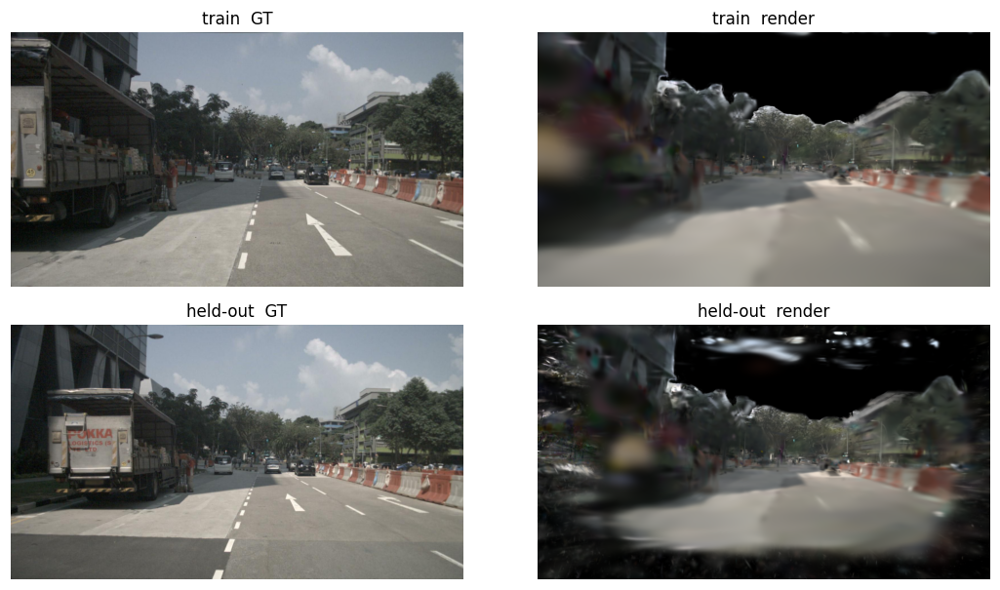
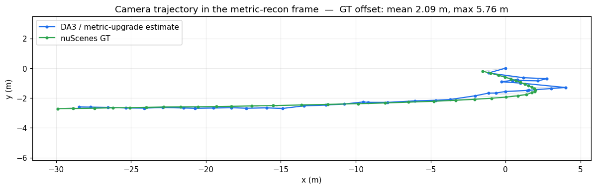

# nuSLAM

Reconstruct a scene from a single nuScenes camera as 3D Gaussians, refine the camera poses
through the differentiable rasterizer, and resolve the monocular scale metrically — never by
reading it from ground truth. Built and evaluated on nuScenes-mini as a proof-of-concept, with
the pipeline structured to scale up to full nuScenes.

## Motivation

A monocular reconstruction is ambiguous: from images alone the geometry is fixed only up to a
projective transform, and a calibrated one only up to a global scale. Existing monocular
splat-SLAM (MonoGS) inherits that scale ambiguity; uncalibrated feed-forward approaches
(VGGT-SLAM) inherit the full projective ambiguity. The problem of interest is recovering metric
geometry — real metres — without ever reading scale from ground truth, as a real vehicle must
from cameras plus cheap proprioception.

The approach collapses one ambiguity at a time with an independent piece of knowledge: known
intrinsics collapse the projective reconstruction to metric-up-to-scale via a dual-absolute-quadric
(DAQ) solve, and the remaining global scale is resolved from a GPS/IMU reference trajectory (with
a semantic ground/wheel anchor as the eventual, GT-free scale source). Resolving metric scale
inside a Gaussian-splat reconstruction, projective collapsed to metric-up-to-scale first, is the
contribution. Ground truth (nuScenes poses, lidar) is used only as an oracle to score a finished
reconstruction; scale is never fitted from it.

## Method

A sequence of stages, each falsifiable on its own before the next is built.

### DA3-Base reconstruction

Depth Anything 3 (DA3-Base) supplies a full joint monocular reconstruction — per-frame depth,
pose, and intrinsics — but under a wrong, intrinsic-agnostic calibration (a projective
reconstruction). This is the delegated frontend; its per-frame depth also seeds the Gaussian
initialization cloud.

### Metric upgrade (DAQ)

DA3-Base returns per frame a pose $[R_i \mid t_i]$ and its own intrinsics $K_{\mathrm{da3},i}$;
interpreting those cameras with the true $K_{\mathrm{true}}$ gives a reconstruction that is only
projective, related to the metric scene by a single $4\times4$ world homography $H$. Normalizing
each camera by its known per-frame intrinsic mismatch $M_i = K_{\mathrm{true}}^{-1}K_{\mathrm{da3},i}$
(the mismatches need not be equal — DA3's focal drifts per frame, and each is folded into its own
camera) makes every normalized camera a calibrated one times that one homography, so its dual image
of the absolute conic is $I$:

$$\tilde P_i = M_i\,[R_i \mid t_i] = [R_i^{\ast}\mid t_i^{\ast}]\,H,\qquad \Omega^{\ast}=H^{-1}\,\mathrm{diag}(1,1,1,0)\,H^{-\top}$$

The dual absolute quadric $\Omega^{\ast}$ then satisfies, per camera and up to an unknown per-frame
scale $\lambda_i^{2}$:

$$\tilde P_i\,\Omega^{\ast}\,\tilde P_i^{\top}=\lambda_i^{2}\,I_3$$

Encoding "proportional to $I$" (off-diagonals zero, diagonals equal) eliminates $\lambda_i^{2}$ and
leaves linear homogeneous constraints on the ten entries of the symmetric $\Omega^{\ast}$; stacked,
they form a DLT solved by the smallest right singular vector, projected to rank-3 PSD. The plane at
infinity is the null vector, $\Omega^{\ast}\pi_\infty = 0$; fixing camera 0 as canonical, the
rectifying homography $H$ takes the block form with top-left $M_0$ and bottom row $(v^{\top}\; s)$,
where $\pi_\infty = (v, s)$ and $M_0 = K_{\mathrm{true}}^{-1}K_{\mathrm{da3},0}$ is the first
camera's mismatch. It upgrades the reconstruction by $X_{\mathrm{metric}} = H\,X_{\mathrm{proj}}$.
`nuslam.recon.metric_upgrade`.

Dominantly-forward driving under-constrains the plane at infinity, so the plain solve lets the
conic block $\Omega^{\ast}_{3\times3}$ drift from the value it must equal,
$W_0 = M_0^{-1}M_0^{-\top}$ (known, since $M_0$ is). A soft prior (`--m-weight`) pins that block to
$W_0$; the free correctness check is that each recovered $K \approx \mathrm{diag}(c,c,1)$.

### Scale resolution

The one remaining scalar is currently resolved from GPS. GPS (nuScenes-CAN) measures the ego ground
point, offset from the recovered camera centre $C_i$ by the camera-to-ground lever arm
$a = -R_{c2e}^{\top} t_{c2e}$ (the ego origin in the camera frame, metric, from the `sensor2ego`
extrinsic). Rotating it into the world frame by each camera's own recovered orientation,
$b_i = R^{w}_i\,a$, and pinning the target to the measured ground plane,
$y_i = (\mathrm{gps}_{x,i},\ \mathrm{gps}_{y,i},\ 0)$, the metric scale is the Sim(3) fit minimizing

$$E(s,R,t)=\frac1n\sum_i\big\lVert y_i-sRC_i-Rb_i-t\big\rVert^{2}$$

Eliminating $t$ (centroids) and $s$ in closed form leaves an objective in $R$ that is quadratic —
the $(\mathrm{tr}\,RA)^{2}/P$ scale–lever-arm coupling — not the linear trace the Procrustes SVD
closes, so no finite closed form exists. It is solved as a fixed point: initialize $R = I$, form
modified targets $y_i - R\,b_i$, run a plain closed-form Umeyama Sim(3) fit of $\{C_i\}$ onto them,
and repeat (two–three iterations suffice). The $z = 0$ pin supplies the vertical a 2-D GPS track
lacks; the camera height enters only through the measured $a$, never assumed. The semantic
ground/wheel-contact anchor — the intended scale source, acting directly on the Gaussians — is the
core next step (see Roadmap). The same Umeyama fit against GT scores a finished reconstruction
(ATE/RPE); once scale is resolved legitimately its $s$ reads $\approx 1$.

### Gaussian-splat reconstruction

The metric cloud seeds a 3D Gaussian-splat reconstruction, optimized with gsplat's rasterizer and
MCMC densification. The representation is reparametrized so every raw parameter is unconstrained
and every step stays a valid Gaussian (scale via $\exp$, opacity via $\sigma$, quaternions
normalized). Sky is segmented with CLIPSeg and masked out of both the loss and the initialization,
so no Gaussians are grown to reconstruct sky. The photometric loss is L1 + D-SSIM over non-sky
pixels; with per-pixel keep-mask $m$, render $\hat I$ and target $I$:

$$\mathcal{L}=(1-\lambda)\,\frac{\sum_i m_i\,\lVert \hat I_i - I_i\rVert_1}{\sum_i m_i}+\lambda\,\big(1-\mathrm{SSIM}(m\hat I,\,mI)\big),\qquad \lambda=0.5$$

The photometric term is scale-free. The metric-anchor loss (ground-plane + wheel-contact residual)
is the term that breaks the scale gauge and makes the reconstruction natively metric; with joint
pose refinement through the rasterizer it is the current work (see Roadmap).

## Architecture

| Component | Module / symbol | Status |
|---|---|---|
| nuScenes monocular keyframe stream + calibration/GT + windowing | `nuslam.data` | infrastructure |
| Monocular depth + DA3-Base reconstruction (depth+pose+K) | `nuslam.frontend` | infrastructure |
| Road/ground + sky segmentation (CLIPSeg), tracking (CoTracker/KLT) | `nuslam.frontend` | infrastructure |
| Lidar-into-camera projection: calib check + depth-vs-lidar eval | `nuslam.data` / `nuslam.eval` | infrastructure |
| DA3 metric upgrade: DAQ solve, rectifying homography, metric cameras/depth/cloud | `nuslam.recon.metric_upgrade` | core — built + tested |
| GPS/IMU Sim(3) scale fit | `nuslam.recon` | core — built |
| Ground/wheel-contact scale anchor; Gaussian pose refinement; metric-anchor loss | `nuslam.recon` | core — in progress |
| 3DGS representation, gsplat calls, training loop, photometric loss, sky masking | `nuslam.recon.gaussians` | core — built |
| Rerun logging (images, frusta, point clouds, splats) + figures | `nuslam.viz` | infrastructure |
| Trajectory eval (Umeyama Sim(3)/SE(3), ATE/RPE) — GT as oracle | `nuslam.eval` | infrastructure |
| Factor-graph SLAM integration (render-as-a-factor + fusion) | `nuslam.backend` | parked |

The reconstruction core — the Gaussian representation and initialization, the gsplat rasterizer
calls, the training loop, the pose refinement, the losses, the DAQ metric-upgrade solve, and the
scale-resolution geometry — is written by hand. The only delegated dependency is gsplat's internal
CUDA kernels; the surrounding data, segmentation, frontend models, visualization, and evaluation
are infrastructure.

## Results

Run on nuScenes-mini `scene-0061` (39 keyframes, CAM_FRONT), for pipeline validation and fast
iteration.

### Metric upgrade

The $M_0$ soft prior is the difference between a drifting and a well-conditioned DAQ solve on
near-straight driving:

| Metric | `--m-weight 0` | `--m-weight 1` (default) |
|---|---|---|
| Conic-block-vs-$W_0$ deviation | 0.33 | **0.04** |
| Null-space eigenvalue gap $A_{\mathrm{gap}}$ | 1.4 | **3.1** |
| Recovered-$K$ anisotropy (max) | 1.11 | **0.53** |
| Oracle ATE rmse (m) | 4.5 | **2.2** |

The prior does not touch $\mathrm{RPE}_t$ — that residual lives in DA3's own reconstruction
geometry, not the upgrade. The GPS scale fit resolves the global scale at 20.57 (recon units →
metres) on this scene, with no use of GT.

<p align="center"></p>
<p align="center"><sub>Metric-upgraded DA3 point cloud and camera frusta along the recovered trajectory, aligned to the GPS and GT reference tracks by the Sim(3) GPS fit.</sub></p>

### Gaussian-splat reconstruction

The static reconstruction runs metrically with sky masked out. Held-out novel-view PSNR peaks
early (~14.8 dB near iteration 500) and then declines to ~14 dB as the Gaussian count grows to the
5M cap — added Gaussians overfit the training views rather than improving novel views.

<p align="center"></p>

Train views reconstruct roughly; held-out views are noticeably ghosted, with floaters where the
scene is dynamic or under-constrained.

<p align="center"></p>

The reconstruction rendered along the estimated (DA3/metric-upgrade) camera trajectory:

https://github.com/user-attachments/assets/24267471-20ec-42ac-b5f3-408f441124a0

<p align="center"><sub>Regenerate with <code>scripts/render_gs_video.py --scene scene-0061 --run run4 --mode flythrough</code>.</sub></p>

The ceiling is not Gaussian count or iterations (both were saturated) but pose error: the frozen
DA3/metric-upgrade trajectory sits a mean of 2.09 m (max 5.76 m) from GT after the Sim(3)
alignment, so the training views themselves are placed wrong.

<p align="center"></p>

This motivates the two next steps (dynamic-object handling and pose refinement through the
rasterizer) over adding more Gaussians.

### Qualitative outputs

Produced by the viz scripts (into the gitignored `out/`):

- `scripts/render_gs_video.py --mode panel` — a grid of train + held-out views, GT over the
  render, evolving across the run's snapshots.
- `scripts/render_gs_video.py --mode flythrough --trajectory both` — the final snapshot rendered
  along the estimated and the actual GT camera trajectory (GT poses mapped into the recon frame
  via the Sim(3)); the ~2 m offset is what makes the GT flythrough mis-register.
- `scripts/replay_gs_rrd.py` — the Gaussian evolution + curves + GT/render images as a Rerun
  `.rrd`, scrubbable on the `iter` timeline.

## Roadmap

- Dynamic objects — segment vehicles with CLIPSeg and either drop them from the static-scene loss
  or reconstruct them as posed per-instance Gaussians composed back onto the scene.
- Pose refinement — unfreeze the camera poses and optimize them through the rasterizer via an
  SE(3) tangent-space delta, to close the ~2 m gap that caps render quality.
- Ground/wheel scale anchor — the semantic metric anchor acting directly on the Gaussians,
  de-risked first with an explicit scalar, then folded into the joint optimization.
- Factor-graph SLAM — lift the batch optimization into a GTSAM/iSAM2 graph with the render as a
  factor, plus IMU/GPS/wheel fusion and loop closure.

## How to run

Setup:

```bash
./scripts/setup_env.sh      # venv (reuses system torch 2.9.1+cu129) + pip deps
./scripts/setup_gsplat.sh   # matched CUDA 12.9 toolchain + gsplat kernels built
```

`setup_gsplat.sh` exists because gsplat JIT-compiles its CUDA kernels against the torch build,
which needs a 12.x nvcc while the system nvcc is 13.1; it installs a CUDA 12.9 conda toolchain and
a `.pth` hook so every `.venv/bin/python` builds/loads gsplat transparently. Verify:

```bash
.venv/bin/python -c "import gsplat; from gsplat.cuda._backend import _C; print('gsplat', gsplat.__version__, _C is not None)"
```

Data — nuScenes v1.0-mini (~4.2 GB, no login). Symlink an existing copy or fetch:

```bash
ln -s /path/to/nuscenes data/nuscenes      # or: ./scripts/download_data.sh data/nuscenes
```

Verify the infrastructure before trusting anything downstream — clean masks and correct geometry
first:

```bash
.venv/bin/python scripts/inspect_sample.py --scene scene-0061 --index 10 --lidar --out out/calib_lidar.png
.venv/bin/python scripts/run_frontend.py --scene scene-0061 --preview out/frontend_preview
.venv/bin/python scripts/run_depth.py --scene scene-0061 --preview out/depth_preview
```

Metric upgrade → metric-up-to-scale reconstruction:

```bash
.venv/bin/python scripts/run_recon.py --scene scene-0061            # DA3-Base depth+pose+K, cached
.venv/bin/python scripts/run_metric_upgrade.py --scene scene-0061 --rerun   # DAQ solve, metric cameras
# --eval-gt (oracle) Sim(3)-aligns to GT to print ATE and the scale the GPS fit should reproduce
```

Gaussian-splat reconstruction (sky masked; snapshots + curves + renders written under the run dir):

```bash
PYTHONPATH=src .venv/bin/python scripts/run_gs.py --scene scene-0061 --train \
    --mask-sky --voxel 0.3 --run-name run4
```

Result figures and videos:

```bash
python scripts/make_readme_figures.py --scene scene-0061 --run run4     # docs/ montage, curves, trajectory
python scripts/render_gs_video.py --scene scene-0061 --run run4 --mode both --trajectory both
python scripts/replay_gs_rrd.py --scene scene-0061 --run run4           # out/run4.rrd  (open: rerun out/run4.rrd)
```

Tests: `.venv/bin/python -m pytest tests/ -q` (data-dependent tests skip if the mini split is absent).

## Layout

```
src/nuslam/
  transforms.py          SE(3) helpers (numpy)
  types.py               data contract: CameraCalib, Keyframe, TrackSet, GroundMask, DepthMap, streams
  data/                  nuScenes monocular source, CAN streams, lidar->camera projection
  frontend/              DA3 depth + DA3-Base reconstruction, CLIPSeg, tracking (CoTracker+KLT), cache
  viz/                   Rerun logging (images/frusta/points/GaussianSplats3D) + figures
  eval/                  Umeyama Sim(3)/SE(3) + ATE/RPE + depth-vs-lidar (GT as oracle)
  backend/               factor-graph SLAM — parked
  recon/                 reconstruction core — written by hand
    metric_upgrade.py      DAQ metric upgrade -> metric-up-to-scale — built + tested
    gaussians.py           3DGS representation, gsplat calls, training loop, photometric loss — built
    (ground/wheel scale anchor, pose refinement, metric-anchor loss — in progress)
scripts/                 setup, data, inspect_sample, run_frontend, run_depth, run_recon,
                         run_metric_upgrade, run_gs, render_gs_video, replay_gs_rrd, make_readme_figures
tests/                   unit (transforms/metrics/cache/seeding/refine/metric_upgrade) + mini-data
```
