# nuSLAM

Reconstruct a scene from a single nuScenes camera as 3D Gaussians, refine the camera poses
through the differentiable rasterizer, and resolve the monocular scale metrically — never by
reading it from ground truth. Built and evaluated on nuScenes-mini as a proof-of-concept, with
the pipeline structured to scale up to full nuScenes.

## Motivation

A monocular reconstruction is ambiguous: from images alone the geometry is fixed only up to a
projective transform, and a calibrated one only up to a global scale. Existing monocular
splat-SLAM (MonoGS) inherits that scale ambiguity; uncalibrated feed-forward approaches
(VGGT-SLAM) inherit the full projective ambiguity. The problem of interest is recovering metric
geometry — real metres — without ever reading scale from ground truth, as a real vehicle must
from cameras plus cheap proprioception.

The approach collapses one ambiguity at a time with an independent piece of knowledge: known
intrinsics collapse the projective reconstruction to metric-up-to-scale via a dual-absolute-quadric
(DAQ) solve, and the remaining global scale is resolved from a GPS/IMU reference trajectory (with
a semantic ground/wheel anchor as the eventual, GT-free scale source). Resolving metric scale
inside a Gaussian-splat reconstruction, projective collapsed to metric-up-to-scale first, is the
contribution. Ground truth (nuScenes poses, lidar) is used only as an oracle to score a finished
reconstruction; scale is never fitted from it.

## Method

A sequence of stages, each falsifiable on its own before the next is built.

### DA3-Base reconstruction

Depth Anything 3 (DA3-Base) supplies a full joint monocular reconstruction — per-frame depth,
pose, and intrinsics — but under a wrong, intrinsic-agnostic calibration (a projective
reconstruction). This is the delegated frontend; its per-frame depth also seeds the Gaussian
initialization cloud.

DA3 assumes a static scene and takes no mask input, so moving vehicles corrupt its pose solve —
on this scene the recovered trajectory drifts a mean of 2.09 m from GT (see Results). Its dense
metric depth is still the best init available, so the pipeline keeps DA3 for depth and takes the
camera poses from a masked structure-from-motion solve instead (below).

### Metric upgrade (DAQ)

DA3-Base returns per frame a pose $[R_i \mid t_i]$ and its own intrinsics $K_{\mathrm{da3},i}$;
interpreting those cameras with the true $K_{\mathrm{true}}$ gives a reconstruction that is only
projective, related to the metric scene by a single $4\times4$ world homography $H$. Normalizing
each camera by its known per-frame intrinsic mismatch $M_i = K_{\mathrm{true}}^{-1}K_{\mathrm{da3},i}$
(the mismatches need not be equal — DA3's focal drifts per frame, and each is folded into its own
camera) makes every normalized camera a calibrated one times that one homography, so its dual image
of the absolute conic is $I$:

$$\tilde P_i = M_i\,[R_i \mid t_i] = [R_i^{\ast}\mid t_i^{\ast}]\,H,\qquad \Omega^{\ast}=H^{-1}\,\mathrm{diag}(1,1,1,0)\,H^{-\top}$$

The dual absolute quadric $\Omega^{\ast}$ then satisfies, per camera and up to an unknown per-frame
scale $\lambda_i^{2}$:

$$\tilde P_i\,\Omega^{\ast}\,\tilde P_i^{\top}=\lambda_i^{2}\,I_3$$

Encoding "proportional to $I$" (off-diagonals zero, diagonals equal) eliminates $\lambda_i^{2}$ and
leaves linear homogeneous constraints on the ten entries of the symmetric $\Omega^{\ast}$; stacked,
they form a DLT solved by the smallest right singular vector, projected to rank-3 PSD. The plane at
infinity is the null vector, $\Omega^{\ast}\pi_\infty = 0$; fixing camera 0 as canonical, the
rectifying homography $H$ takes the block form with top-left $M_0$ and bottom row $(v^{\top}\; s)$,
where $\pi_\infty = (v, s)$ and $M_0 = K_{\mathrm{true}}^{-1}K_{\mathrm{da3},0}$ is the first
camera's mismatch. It upgrades the reconstruction by $X_{\mathrm{metric}} = H\,X_{\mathrm{proj}}$.
`nuslam.recon.metric_upgrade`.

Dominantly-forward driving under-constrains the plane at infinity, so the plain solve lets the
conic block $\Omega^{\ast}_{3\times3}$ drift from the value it must equal,
$W_0 = M_0^{-1}M_0^{-\top}$ (known, since $M_0$ is). A soft prior (`--m-weight`) pins that block to
$W_0$; the free correctness check is that each recovered $K \approx \mathrm{diag}(c,c,1)$.

### Scale resolution

The one remaining scalar is currently resolved from GPS. GPS (nuScenes-CAN) measures the ego ground
point, offset from the recovered camera centre $C_i$ by the camera-to-ground lever arm
$a = -R_{c2e}^{\top} t_{c2e}$ (the ego origin in the camera frame, metric, from the `sensor2ego`
extrinsic). Rotating it into the world frame by each camera's own recovered orientation,
$b_i = R^{w}_i\,a$, and pinning the target to the measured ground plane,
$y_i = (\mathrm{gps}_{x,i},\ \mathrm{gps}_{y,i},\ 0)$, the metric scale is the Sim(3) fit minimizing

$$E(s,R,t)=\frac1n\sum_i\big\lVert y_i-sRC_i-Rb_i-t\big\rVert^{2}$$

Eliminating $t$ (centroids) and $s$ in closed form leaves an objective in $R$ that is quadratic —
the $(\mathrm{tr}\,RA)^{2}/P$ scale–lever-arm coupling — not the linear trace the Procrustes SVD
closes, so no finite closed form exists. It is solved as a fixed point: initialize $R = I$, form
modified targets $y_i - R\,b_i$, run a plain closed-form Umeyama Sim(3) fit of $\{C_i\}$ onto them,
and repeat (two–three iterations suffice). The $z = 0$ pin supplies the vertical a 2-D GPS track
lacks; the camera height enters only through the measured $a$, never assumed. The semantic
ground/wheel-contact anchor — the intended scale source, acting directly on the Gaussians — is the
core next step (see Roadmap). The same Umeyama fit against GT scores a finished reconstruction
(ATE/RPE); once scale is resolved legitimately its $s$ reads $\approx 1$.

### Camera poses (COLMAP)

Because DA3's poses are corrupted by dynamic objects, the training cameras come from a
structure-from-motion solve (COLMAP, `pycolmap`) run over the same keyframes with the sky and
vehicle pixels masked out of feature extraction, so no correspondences are drawn from moving
objects. Forward driving is near-degenerate for SfM (low parallax, a thin motion baseline), so the
solve is conditioned with the known `PINHOLE` intrinsics held fixed and a low minimum
triangulation angle, which registers all 39 frames. The sparse SfM points are discarded; only the
per-frame poses are kept. Those poses are up-to-scale in COLMAP's own frame, so they are brought
into metres by the *same* iterated lever-arm Umeyama fit used for DA3 — one Sim(3) over the whole
trajectory — and cached per keyframe. The dense Gaussian init cloud is still back-projected from
DA3's homography-rectified metric depth, now from the COLMAP poses. `scripts/cache_colmap_poses.py`,
`run_gs.py --colmap-poses`.

### Gaussian-splat reconstruction

The metric cloud seeds a 3D Gaussian-splat reconstruction, optimized with gsplat's rasterizer
(render mode `RGB+ED`, so each pass also returns the expected depth) and MCMC densification to a
5M-Gaussian cap. The representation is reparametrized so every raw parameter is unconstrained and
every step stays a valid Gaussian (scale via $\exp$, opacity via $\sigma$, quaternions normalized).
Sky and vehicles are segmented with SAM3 (`facebook/sam3`, text-prompted instance masks; CLIPSeg is
a fallback) and masked out of both the loss and the initialization, so no Gaussians are grown to
reconstruct sky or moving objects; the masks are cached per prompt like depth and poses. The
photometric loss is L1 + D-SSIM over the kept pixels; with per-pixel keep-mask $m$, render
$\hat I$ and target $I$:

$$\mathcal{L}_{\mathrm{photo}}=(1-\lambda)\,\frac{\sum_i m_i\,\lVert \hat I_i - I_i\rVert_1}{\sum_i m_i}+\lambda\,\big(1-\mathrm{SSIM}(m\hat I,\,mI)\big),\qquad \lambda=0.5$$

Three optional supervision/regularization terms are added on top. A depth term ties the rendered
expected depth $\hat D$ to DA3's homography-rectified metric depth $D$ (in metres, same units as
the Gaussians) over kept pixels with valid depth. A sky term pushes the render to black where the
sky mask $s$ fires, so the masked region is not left to floaters. And the two MCMC regularizers act
on the *activated* parameters — an opacity-sparsity L1 on $\sigma(o)$ and a covariance L1 on the
scales $\exp(\ell)$ (the square-roots of the eigenvalues of $\Sigma$) — each a mean, to match the
mean-reduced photometric loss:

$$\mathcal{L}=\mathcal{L}_{\mathrm{photo}}+\lambda_{d}\,\frac{\sum m\,\lvert \hat D-D\rvert}{\sum m}+\lambda_{s}\,\frac{\sum s\,\lvert\hat I\rvert}{3\sum s}+\lambda_{o}\,\overline{\sigma(o)}+\lambda_{c}\,\overline{\exp(\ell)}$$

The means learning rate follows the 3DGS `spatial_lr_scale` convention — the base rate times the
camera-bounding radius ($\times 1.1$) — so in a metric scene tens of metres across the means
actually move rather than freezing. The photometric term is scale-free; the metric-anchor loss
(ground-plane + wheel-contact residual) is the term that will break the scale gauge and make the
reconstruction natively metric, with joint pose refinement through the rasterizer, the current work
(see Roadmap).

## Architecture

| Component | Module / symbol | Status |
|---|---|---|
| nuScenes monocular keyframe stream + calibration/GT + windowing | `nuslam.data` | infrastructure |
| Monocular depth + DA3-Base reconstruction (depth+pose+K) | `nuslam.frontend` | infrastructure |
| Sky/vehicle segmentation (SAM3, CLIPSeg fallback), tracking (CoTracker/KLT) | `nuslam.frontend` | infrastructure |
| Lidar-into-camera projection: calib check + depth-vs-lidar eval | `nuslam.data` / `nuslam.eval` | infrastructure |
| DA3 metric upgrade: DAQ solve, rectifying homography, metric cameras/depth/cloud | `nuslam.recon.metric_upgrade` | core — built + tested |
| GPS/IMU Sim(3) scale fit | `nuslam.recon` | core — built |
| COLMAP (masked SfM) camera poses, Umeyama-aligned to metres | `pycolmap` + `nuslam.recon` | infrastructure |
| Ground/wheel-contact scale anchor; Gaussian pose refinement; metric-anchor loss | `nuslam.recon` | core — in progress |
| 3DGS representation, gsplat calls, training loop, photometric + depth + sky losses, MCMC regularizers, sky/vehicle masking | `nuslam.recon.gaussians` | core — built |
| Rerun logging (images, frusta, point clouds, splats) + figures | `nuslam.viz` | infrastructure |
| Trajectory eval (Umeyama Sim(3)/SE(3), ATE/RPE) — GT as oracle | `nuslam.eval` | infrastructure |
| Factor-graph SLAM integration (render-as-a-factor + fusion) | `nuslam.backend` | parked |

The reconstruction core — the Gaussian representation and initialization, the gsplat rasterizer
calls, the training loop, the pose refinement, the losses, the DAQ metric-upgrade solve, and the
scale-resolution geometry — is written by hand. The only delegated dependency is gsplat's internal
CUDA kernels; the surrounding data, segmentation, frontend models, visualization, and evaluation
are infrastructure.

## Results

Run on nuScenes-mini `scene-0061` (39 keyframes, CAM_FRONT), for pipeline validation and fast
iteration.

### Metric upgrade

The $M_0$ soft prior is the difference between a drifting and a well-conditioned DAQ solve on
near-straight driving:

| Metric | `--m-weight 0` | `--m-weight 1` (default) |
|---|---|---|
| Conic-block-vs-$W_0$ deviation | 0.33 | **0.04** |
| Null-space eigenvalue gap $A_{\mathrm{gap}}$ | 1.4 | **3.1** |
| Recovered-$K$ anisotropy (max) | 1.11 | **0.53** |
| Oracle ATE rmse (m) | 4.5 | **2.2** |

The prior does not touch $\mathrm{RPE}_t$ — that residual lives in DA3's own reconstruction
geometry, not the upgrade. The GPS scale fit resolves the global scale at 20.57 (recon units →
metres) on this scene, with no use of GT.

<p align="center">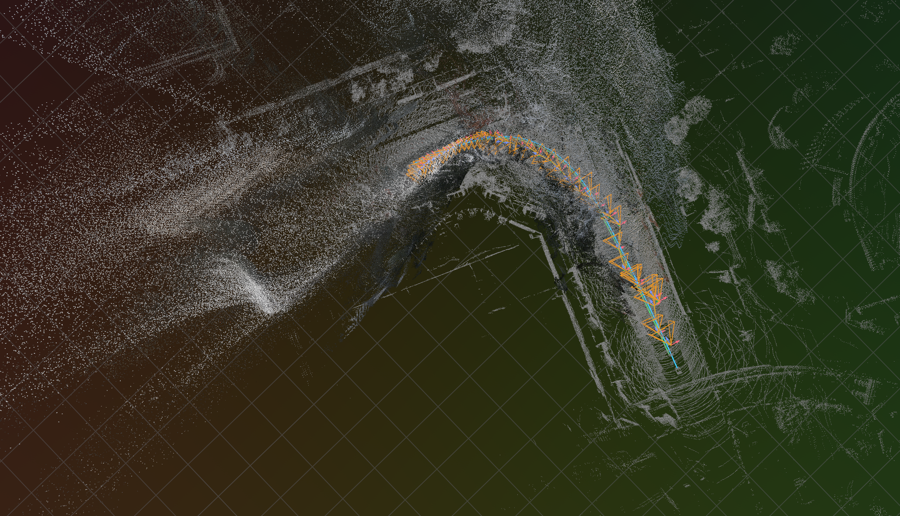</p>
<p align="center"><sub>Metric-upgraded DA3 point cloud and camera frusta along the recovered trajectory, aligned to the GPS and GT reference tracks by the Sim(3) GPS fit.</sub></p>

### Camera poses

DA3's poses were the reconstruction ceiling. After the Sim(3) GPS alignment its trajectory sits a
mean of 2.09 m from GT (2.28 m RMS GPS residual), the error concentrated on the frames where
vehicles move through the scene — DA3 assumes a static world and cannot tell a moving car from
fixed structure. Re-solving the poses with masked COLMAP SfM and the *same* GPS Umeyama collapses
that to a 0.16 m GPS residual and a 0.11 m median (0.19 m mean) offset from GT over the 91 m
trajectory — matching a GT-pose oracle without ever touching GT.

| Pose source | GPS-align residual | vs GT (mean / median) |
|---|---|---|
| DA3 metric-upgrade | 2.28 m | 2.09 m / — |
| COLMAP (masked SfM) | **0.16 m** | **0.19 m / 0.11 m** |

<p align="center">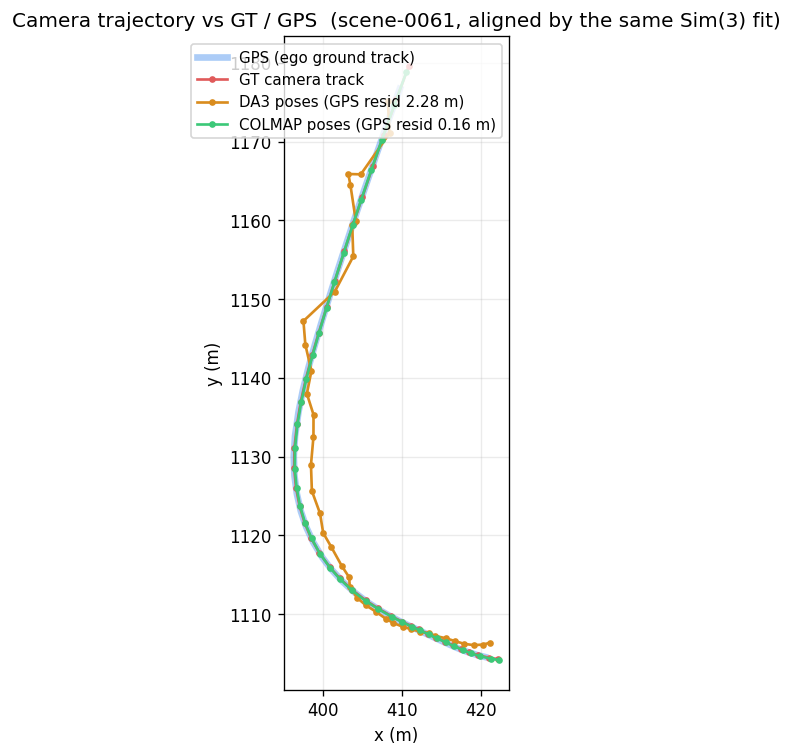</p>
<p align="center"><sub>Top-down camera trajectory in the nuScenes global frame: COLMAP (green) sits on GT (red) and the GPS track (blue); DA3 (orange) zigzags off wherever the scene is dynamic.</sub></p>

The same contrast in 3D over the dense cloud — COLMAP poses lie clean along the trajectory (top),
DA3 poses jitter off the GT track (bottom):

<p align="center">
  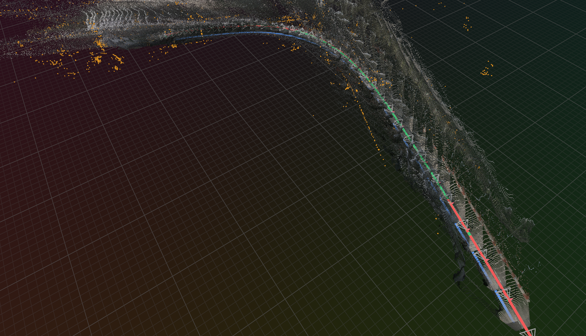
  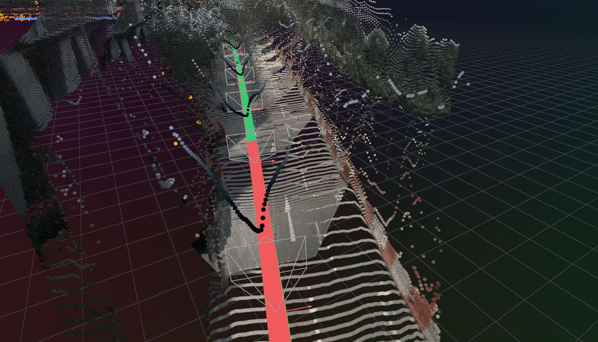
</p>
<p align="center">
  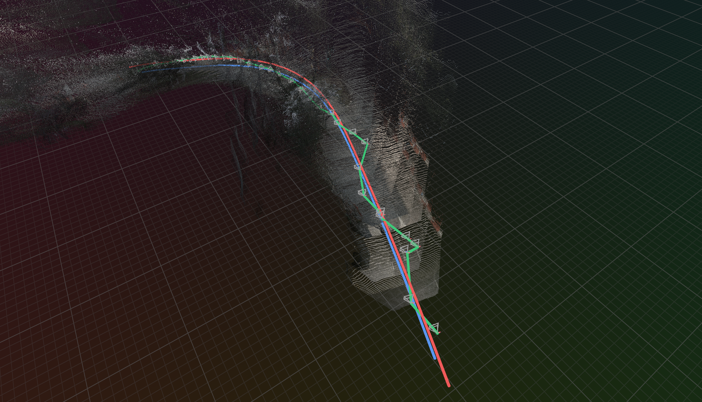
  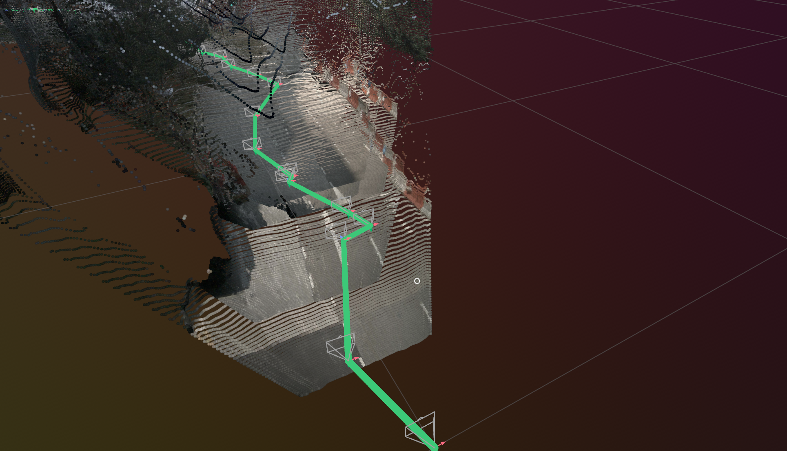
</p>
<p align="center"><sub>COLMAP poses (top) versus DA3 poses (bottom), both against the GT (red) and GPS (blue) references — the DA3 track visibly wanders where COLMAP holds the line.</sub></p>

### Gaussian-splat reconstruction

With COLMAP poses the reconstruction reaches the pose oracle it was capped below. On a five-frame
window (train 3 / hold out 2) COLMAP matches the GT-pose oracle, and dropping the DA3 depth
supervision *helps* — the DA3 depth carries the noisier five-frame scale, and once the geometry is
good it fights the render. Extended to all 39 keyframes (train 34 / hold out 5), with depth back on,
the full run is the strongest on every structural metric, over genuinely novel viewpoints spread
across the whole trajectory:

| Run | Poses | Depth sup. | Frames | PSNR | SSIM | L1 |
|---|---|---|---|---|---|---|
| 5-frame, GT (oracle) | GT | yes | 5 | 10.25 | 0.469 | 0.186 |
| 5-frame, COLMAP | COLMAP | yes | 5 | 10.27 | 0.474 | 0.187 |
| 5-frame, COLMAP | COLMAP | no | 5 | 10.57 | 0.492 | 0.177 |
| Full, COLMAP | COLMAP | yes | 39 | **10.62** | **0.592** | **0.158** |

PSNR is depressed and roughly flat across these runs because the sky→black term renders the masked
sky dark against bright-sky GT over the whole frame; SSIM and L1 are the cleaner cross-run signal,
and both are clearly best on the full COLMAP run.

Five-frame renders, depth supervision (left) versus none (right):

<p align="center">
  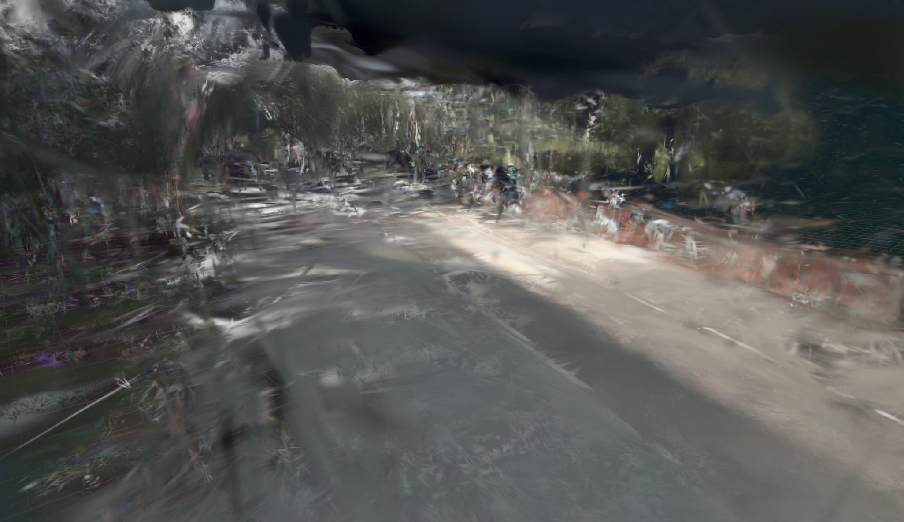
  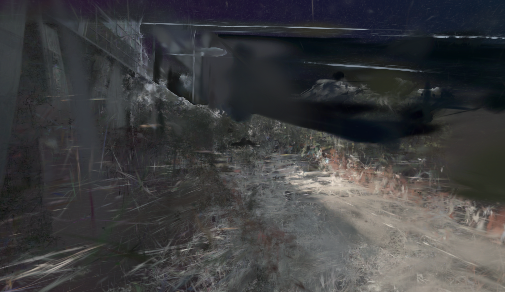
</p>

Full 39-frame reconstruction, rendered along the trajectory:

<p align="center">
  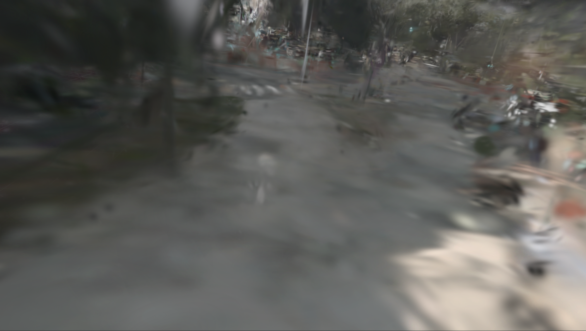
  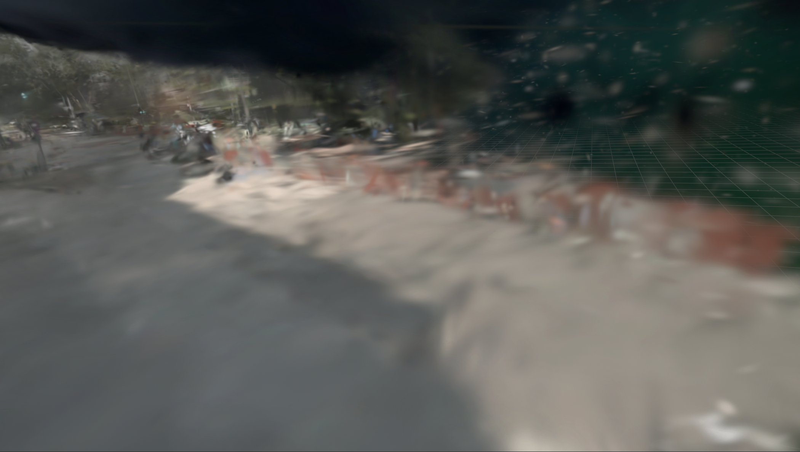
</p>
<p align="center">
  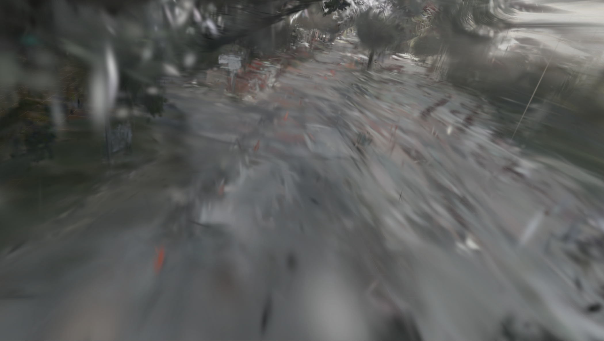
  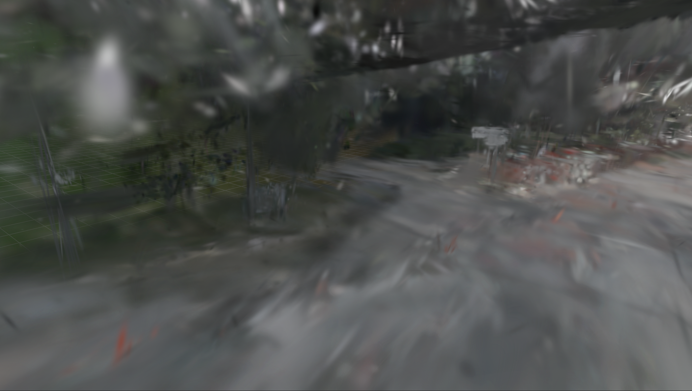
</p>

<p align="center">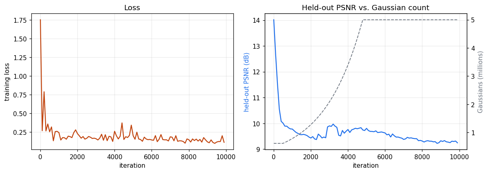</p>

The remaining limit is density, not poses. A 39-frame drive spans ~90 m, and the 5M-Gaussian cap
spreads thin over that extent — worse, most of the budget scatters far outside the scene (at the
final iteration only ~0.46M of the 5M sit within 200 m of the centre). The reconstruction looks
sparse and spiky where coverage is thin:

<p align="center">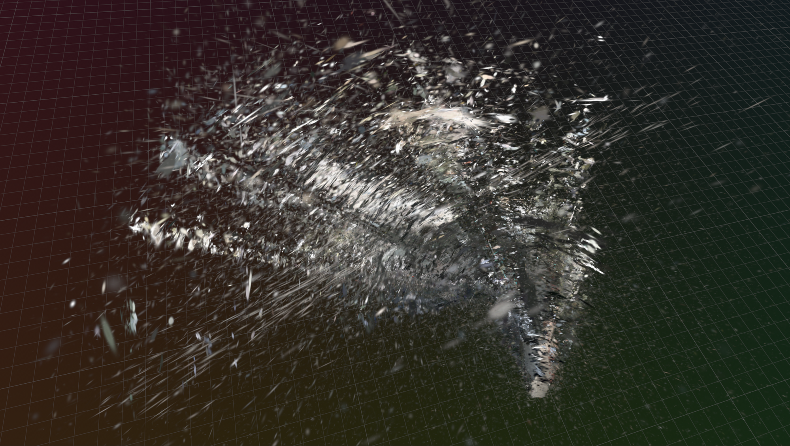</p>

The next step is to bound the reconstruction — mask out far-away points at both initialization and
during optimization — so the Gaussian budget is spent on the scene rather than on distant floaters.

Flythroughs — the final Gaussians rendered along the camera trajectory. The source `.mp4`s live in
`docs/`; upload each via the GitHub GUI and paste its attachment link under the matching heading.

Five-frame COLMAP, with depth supervision (`docs/run5-5frame-colmap_flythrough.mp4`):

https://github.com/user-attachments/assets/77ce4b9b-1048-42a1-b21f-19c910fc7b5d

Five-frame COLMAP, no depth supervision (`docs/run5-5frame-colmap-nodepth_flythrough.mp4`):

https://github.com/user-attachments/assets/a3965007-feaf-4e47-9d17-df4808a910f2

Full 39-frame COLMAP (`docs/run6-full-colmap_flythrough.mp4`):

https://github.com/user-attachments/assets/aee273a4-ce12-43dd-ab8c-20867f21840d

<p align="center"><sub>Regenerate any of these with <code>scripts/render_gs_video.py --scene scene-0061 --run &lt;run&gt; --mode flythrough --colmap-poses</code> (add <code>--max-frames 5 --holdout-every 2 --holdout-offset 1</code> for the five-frame runs).</sub></p>

### Qualitative outputs

Produced by the viz scripts (into the gitignored `out/`), each pose-source aware:

- `scripts/render_gs_video.py --mode flythrough` — the final Gaussians rendered along the camera
  trajectory (`--colmap-poses` / `--gt-poses` to fly the run's own poses).
- `scripts/render_progress_video.py` — the run's saved train + held-out renders, GT over estimate,
  stitched across iterations (correct for any pose source, no re-render).
- `scripts/replay_gs_rrd.py` — the full-density Gaussian evolution (all snapshots + the final) +
  curves + GT/render images as a Rerun `.rrd`, scrubbable on the `iter` timeline.

## Roadmap

- Bound the reconstruction — drop points beyond a range threshold from every camera at
  initialization, and supervise their pixels toward black during optimization (reusing the
  sky→black term). The init cloud back-projects one 3-D point per pixel, so each pixel's range to
  the trajectory is known: a pixel whose point is farther than the threshold from all poses is left
  unconstrained today and grows arbitrary floaters, so pushing it to black spends the capped
  Gaussian budget on the scene instead (currently most of the 5M land outside the scene on the full
  drive). Pair with a low-opacity prune.
- Dynamic objects — vehicles are already masked out of the loss and init (SAM3); the next step is
  reconstructing them as posed per-instance Gaussians composed back onto the static scene.
- Pose refinement — refine the COLMAP poses jointly through the rasterizer via an SE(3)
  tangent-space delta, folding pose and geometry into one optimization.
- Ground/wheel scale anchor — the semantic metric anchor acting directly on the Gaussians (the
  GT-free scale source), de-risked first with an explicit scalar, then folded into the joint
  optimization.
- Factor-graph SLAM — lift the batch optimization into a GTSAM/iSAM2 graph with the render as a
  factor, plus IMU/GPS/wheel fusion and loop closure.

## How to run

Setup:

```bash
./scripts/setup_env.sh      # venv (reuses system torch 2.9.1+cu129) + pip deps
./scripts/setup_gsplat.sh   # matched CUDA 12.9 toolchain + gsplat kernels built
```

`setup_gsplat.sh` exists because gsplat JIT-compiles its CUDA kernels against the torch build,
which needs a 12.x nvcc while the system nvcc is 13.1; it installs a CUDA 12.9 conda toolchain and
a `.pth` hook so every `.venv/bin/python` builds/loads gsplat transparently. Verify:

```bash
.venv/bin/python -c "import gsplat; from gsplat.cuda._backend import _C; print('gsplat', gsplat.__version__, _C is not None)"
```

Data — nuScenes v1.0-mini (~4.2 GB, no login). Symlink an existing copy or fetch:

```bash
ln -s /path/to/nuscenes data/nuscenes      # or: ./scripts/download_data.sh data/nuscenes
```

Verify the infrastructure before trusting anything downstream — clean masks and correct geometry
first:

```bash
.venv/bin/python scripts/inspect_sample.py --scene scene-0061 --index 10 --lidar --out out/calib_lidar.png
.venv/bin/python scripts/run_frontend.py --scene scene-0061 --preview out/frontend_preview
.venv/bin/python scripts/run_depth.py --scene scene-0061 --preview out/depth_preview
```

Metric upgrade → metric-up-to-scale reconstruction:

```bash
.venv/bin/python scripts/run_recon.py --scene scene-0061            # DA3-Base depth+pose+K, cached
.venv/bin/python scripts/run_metric_upgrade.py --scene scene-0061 --rerun   # DAQ solve, metric cameras
# --eval-gt (oracle) Sim(3)-aligns to GT to print ATE and the scale the GPS fit should reproduce
```

Camera poses — masked COLMAP SfM, aligned to metres, cached per keyframe (uses the cached sky/vehicle
SAM3 masks):

```bash
PYTHONPATH=src .venv/bin/python scripts/cache_colmap_poses.py   # -> out/frontend_cache/<scene>/colmap_poses_global.npz
```

Gaussian-splat reconstruction (COLMAP poses; sky + vehicles masked; depth + sky supervision and MCMC
regularizers; snapshots + curves + renders written under the run dir):

```bash
PYTHONPATH=src .venv/bin/python scripts/run_gs.py --scene scene-0061 --train --colmap-poses \
    --mask-sky --sky-threshold 0.5 --mask-vehicles --vehicle-prompt "moving vehicle" \
    --opacity-reg 0.01 --scale-reg 0.01 --depth-lambda 0.05 --sky-lambda 0.05 \
    --voxel 0.3 --run-name run6-full-colmap
# five-frame window: add --max-frames 5 --holdout-every 2 --holdout-offset 1
# oracle pose baseline: swap --colmap-poses for --gt-poses
```

Result figures and videos:

```bash
python scripts/make_readme_figures.py --scene scene-0061 --run run6-full-colmap   # docs/ montage + curves
python scripts/render_gs_video.py --scene scene-0061 --run run6-full-colmap --mode flythrough --colmap-poses
python scripts/render_progress_video.py --scene scene-0061 --run run6-full-colmap # out/<run>_progress.mp4
python scripts/replay_gs_rrd.py --scene scene-0061 --run run6-full-colmap --max-pts 5200000 --every 1
```

Tests: `.venv/bin/python -m pytest tests/ -q` (data-dependent tests skip if the mini split is absent).

## Layout

```
src/nuslam/
  transforms.py          SE(3) helpers (numpy)
  types.py               data contract: CameraCalib, Keyframe, TrackSet, GroundMask, DepthMap, streams
  data/                  nuScenes monocular source, CAN streams, lidar->camera projection
  frontend/              DA3 depth + DA3-Base reconstruction, SAM3/CLIPSeg segmentation, tracking (CoTracker+KLT), cache
  viz/                   Rerun logging (images/frusta/points/GaussianSplats3D) + figures
  eval/                  Umeyama Sim(3)/SE(3) + ATE/RPE + depth-vs-lidar (GT as oracle)
  backend/               factor-graph SLAM — parked
  recon/                 reconstruction core — written by hand
    metric_upgrade.py      DAQ metric upgrade -> metric-up-to-scale — built + tested
    gaussians.py           3DGS representation, gsplat calls, training loop, photometric loss — built
    (ground/wheel scale anchor, pose refinement, metric-anchor loss — in progress)
scripts/                 setup, data, inspect_sample, run_frontend, run_depth, run_recon,
                         run_metric_upgrade, cache_colmap_poses, run_gs, render_gs_video,
                         render_progress_video, replay_gs_rrd, make_readme_figures
tests/                   unit (transforms/metrics/cache/seeding/refine/metric_upgrade) + mini-data
```
